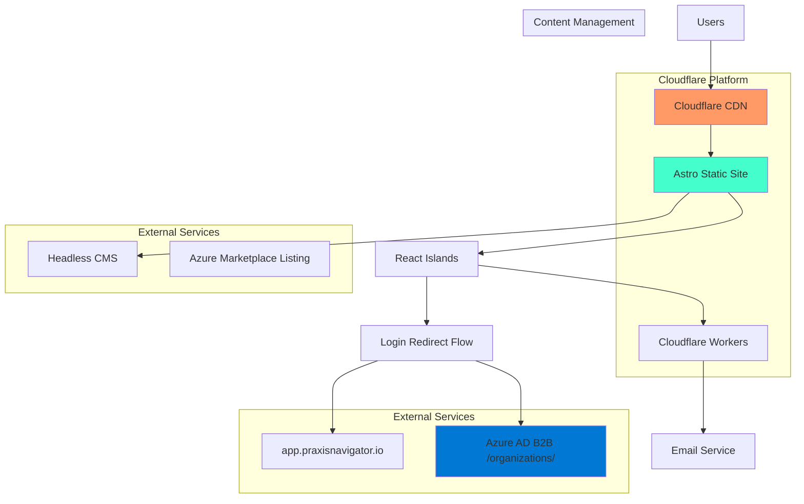
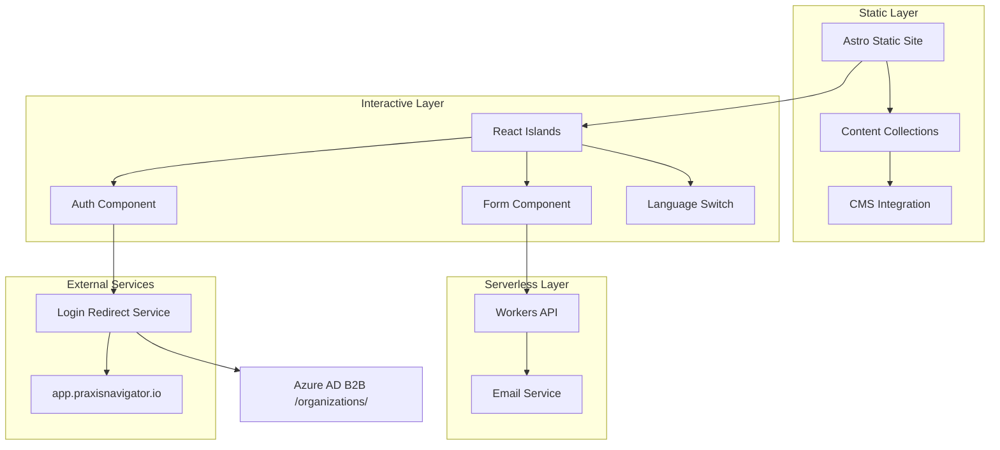
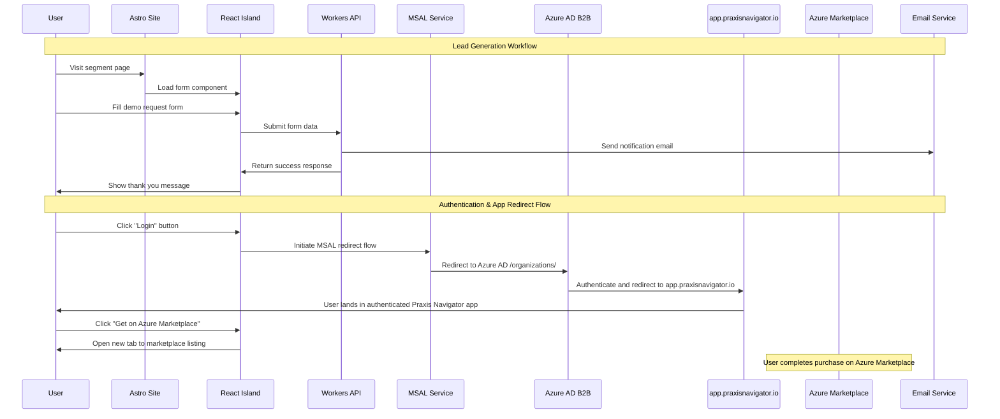
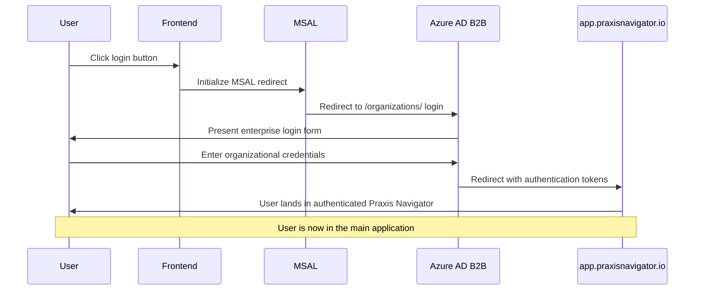
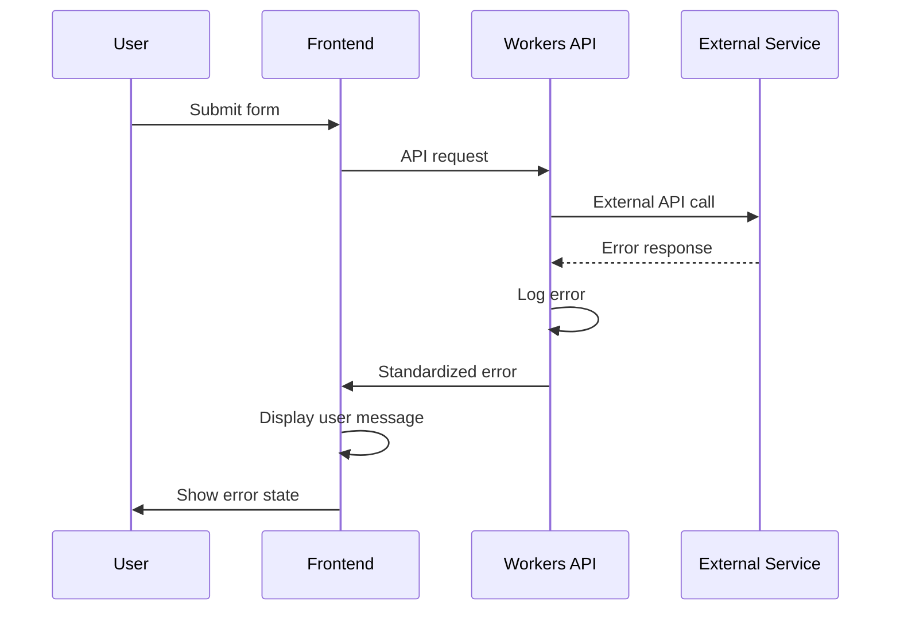

# Praxis Navigator Website Fullstack Architecture Document

**Status**: Draft v1.0  
**Created**: 2025-08-20  
**Author**: Winston (Architect)  
**Project**: Praxis Navigator Static Promotional Website

## Table of Contents

1. [Introduction](#introduction)
2. [High Level Architecture](#high-level-architecture)
3. [Tech Stack](#tech-stack)
4. [Data Models](#data-models)
5. [API Specification](#api-specification)
6. [Components](#components)
7. [External APIs](#external-apis)
8. [Core Workflows](#core-workflows)
9. [Database Schema](#database-schema)
10. [Frontend Architecture](#frontend-architecture)
11. [Backend Architecture](#backend-architecture)
12. [Unified Project Structure](#unified-project-structure)
13. [Development Workflow](#development-workflow)
14. [Deployment Architecture](#deployment-architecture)
15. [Security and Performance](#security-and-performance)
16. [Testing Strategy](#testing-strategy)
17. [Coding Standards](#coding-standards)
18. [Error Handling Strategy](#error-handling-strategy)
19. [Monitoring and Observability](#monitoring-and-observability)

---

## High Level Architecture

### Technical Summary

The Praxis Navigator promotional website employs a modern **Jamstack architecture** using Astro as the static site generator with selective React hydration for interactive components. This approach delivers optimal performance through static generation while enabling dynamic features like form handling, language switching, and seamless login redirects to the main application. The frontend integrates with the Praxis Design System through Tailwind CSS theme configuration, ensuring pixel-perfect brand consistency. The architecture leverages Cloudflare Pages for deployment with integrated analytics, Azure AD B2B authentication flow for application login redirects, and direct marketplace links for seamless product signup flows. This stack achieves the PRD's performance goals (<2s load times, 99.9% uptime) while supporting enterprise-grade lead generation and conversion optimization workflows.

### Platform and Infrastructure Choice

**Platform**: Cloudflare Pages + Azure Services  
**Key Services**: 
- Cloudflare Pages (hosting, CDN, analytics)
- Cloudflare Workers (serverless functions for forms)
- Azure Active Directory B2B (MSAL-based login redirect to app.praxisnavigator.io) 
- Azure Marketplace (external product listing)
- Forestry/Sanity CMS (content management)

**Deployment Host and Regions**: Global edge deployment via Cloudflare with primary regions in US and EU for optimal performance to target markets

**Rationale**: This combination provides enterprise-grade performance and reliability while maintaining cost efficiency for a promotional website. Cloudflare's global CDN ensures <2s load times globally, while Azure B2B authentication flow enables seamless single sign-on transitions from the promotional website directly to the main Praxis Navigator application. The serverless approach eliminates infrastructure management overhead while providing scalability for traffic spikes during marketing campaigns.

### Repository Structure

**Structure**: Monorepo with workspace organization  
**Monorepo Tool**: npm workspaces (lightweight, no additional dependencies)  
**Package Organization**: 
- `/apps/website` - Main Astro application
- `/packages/ui` - Praxis design system components  
- `/packages/shared` - TypeScript types and utilities
- `/apps/cms` - Content management setup (if needed)

### High Level Architecture Diagram



### Architectural Patterns

- **Jamstack Architecture**: Static site generation with serverless functions - *Rationale*: Optimal performance, security, and scalability for content-heavy promotional sites
- **Island Architecture**: Selective hydration of React components - *Rationale*: Minimizes JavaScript bundle size while enabling interactivity where needed  
- **Component-Based UI**: Reusable React components with TypeScript - *Rationale*: Maintainability and consistency with Praxis Design System
- **Edge-First Deployment**: Global CDN with edge computing - *Rationale*: Sub-2-second load times globally as required by PRD
- **Headless CMS Pattern**: Content separation from presentation - *Rationale*: Enables content updates without developer deployment
- **Progressive Enhancement**: Base functionality without JavaScript - *Rationale*: Accessibility and SEO optimization for enterprise users

---

## Tech Stack

### Technology Stack Table

| Category | Technology | Version | Purpose | Rationale |
|----------|------------|---------|---------|-----------|
| **Frontend Language** | TypeScript | ^5.2.0 | Type-safe development | PRD requirement for strict mode, enterprise reliability |
| **Static Site Generator** | Astro | ^3.0.0 | Static site generation with islands | Optimal performance, SEO, selective hydration |
| **UI Framework** | React | ^18.0.0 | Interactive components | Team familiarity, extensive ecosystem |
| **CSS Framework** | Tailwind CSS | ^3.3.0 | Utility-first styling | Praxis Design System integration requirement |
| **UI Component Library** | Custom Praxis Components | 1.0.0 | Brand-consistent components | PRD mandates strict Praxis Design adherence |
| **State Management** | Zustand | ^4.4.0 | Lightweight state management | Simple state needs, TypeScript support |
| **Internationalization** | Astro i18n | Built-in | Multi-language support | English/Norwegian switching requirement |
| **Authentication** | MSAL Browser | ^3.0.0 | Azure AD B2B login redirect to app.praxisnavigator.io | PRD requirement for seamless enterprise login experience |
| **Forms** | React Hook Form | ^7.45.0 | Form validation and handling | Lead generation forms optimization |
| **HTTP Client** | Fetch API | Native | API requests | Native browser support, no extra dependencies |
| **Build Tool** | Vite | ^4.4.0 | Fast development and building | Built into Astro, modern tooling |
| **Package Manager** | npm | ^9.0.0 | Dependency management | Standard tooling, workspace support |
| **Content Management** | Forestry CMS | Latest | Headless content editing | Non-technical content updates |
| **Hosting Platform** | Cloudflare Pages | - | Static hosting with CDN | PRD requirement, global performance |
| **Serverless Functions** | Cloudflare Workers | - | Form processing, API calls | Integrated with hosting, edge performance |
| **Analytics** | Cloudflare Web Analytics | - | Privacy-first analytics | GDPR compliance requirement |
| **Email Service** | Cloudflare Email Workers | - | Form submission handling | Integrated workflow for lead capture |
| **Monitoring** | Sentry | ^7.0.0 | Error tracking and performance | Production debugging and monitoring |
| **Testing Framework** | Vitest | ^0.34.0 | Unit and integration testing | Vite integration, fast execution |
| **E2E Testing** | Playwright | ^1.37.0 | End-to-end testing | Cross-browser testing, reliability |
| **Code Quality** | ESLint + Prettier | Latest | Code formatting and linting | Team consistency, best practices |
| **Type Checking** | TypeScript | ^5.2.0 | Static type analysis | Strict mode requirement from PRD |

---

## Data Models

Since this is a static promotional website, data models are primarily focused on form submissions, content structures, and user session data.

### Content Models

**Purpose**: Structure for website content that can be managed through the CMS

**Key Attributes**:
- `id`: string - Unique identifier
- `title`: string - Page/content title  
- `slug`: string - URL-friendly identifier
- `content`: RichText - Main content body
- `meta`: SEOMeta - SEO metadata
- `publishedAt`: Date - Publication timestamp
- `locale`: 'en' | 'no' - Language identifier

#### TypeScript Interface

```typescript
interface ContentModel {
  id: string;
  title: string;
  slug: string;
  content: RichText;
  meta: SEOMeta;
  publishedAt: Date;
  locale: 'en' | 'no';
  status: 'draft' | 'published';
}

interface SEOMeta {
  title: string;
  description: string;
  keywords: string[];
  ogImage?: string;
  canonicalUrl?: string;
}
```

### Lead Data Models

**Purpose**: Structure for capturing and managing lead generation forms

**Key Attributes**:
- `id`: string - Unique lead identifier
- `type`: LeadType - Form type (demo, trial, contact)
- `contact`: ContactInfo - Contact details
- `company`: CompanyInfo - Organization details  
- `source`: string - Traffic source/campaign
- `segment`: UserSegment - Target user segment
- `submittedAt`: Date - Form submission time

#### TypeScript Interface

```typescript
interface LeadSubmission {
  id: string;
  type: 'demo' | 'trial' | 'contact' | 'whitepaper';
  contact: {
    firstName: string;
    lastName: string;
    email: string;
    phone?: string;
    title?: string;
  };
  company: {
    name: string;
    size: '1-50' | '51-200' | '201-1000' | '1000+';
    industry?: string;
    website?: string;
  };
  segment: 'security-leaders' | 'executives' | 'managers' | 'sat-teams';
  source: string;
  utm: UTMParameters;
  submittedAt: Date;
  qualification: {
    budget?: string;
    timeline?: string;
    authority?: boolean;
    need?: string;
  };
}

interface UTMParameters {
  source?: string;
  medium?: string;
  campaign?: string;
  term?: string;
  content?: string;
}
```

### User Session Models

**Purpose**: Track user interactions and authentication state

**Key Attributes**:
- `sessionId`: string - Session identifier
- `user`: UserInfo - Authenticated user data
- `preferences`: UserPreferences - Language, theme settings
- `journey`: UserJourney[] - Page navigation tracking

#### TypeScript Interface

```typescript
interface UserSession {
  sessionId: string;
  user?: {
    objectId: string;
    email: string;
    name: string;
    tenantId: string;        // Always present for B2B organizations
    organizationName?: string;
  };
  preferences: {
    language: 'en' | 'no';
    timezone: string;
    consentGiven: boolean;
  };
  journey: UserJourney[];
  utm?: UTMParameters;
}

interface UserJourney {
  page: string;
  timestamp: Date;
  duration?: number;
  source?: string;
  action?: string;
}
```

---

## API Specification

Since this is a static website, APIs are primarily for form submissions and external integrations. The following describes the Cloudflare Workers API endpoints:

### REST API Specification

```yaml
openapi: 3.0.0
info:
  title: Praxis Navigator Website API
  version: 1.0.0
  description: Serverless functions for form processing and integrations
servers:
  - url: https://praxis-website.pages.dev/api
    description: Production API via Cloudflare Workers

paths:
  /forms/submit:
    post:
      summary: Submit lead generation form
      description: Process form submissions and trigger follow-up workflows
      requestBody:
        required: true
        content:
          application/json:
            schema:
              $ref: '#/components/schemas/LeadSubmission'
      responses:
        '200':
          description: Form submitted successfully
          content:
            application/json:
              schema:
                type: object
                properties:
                  success:
                    type: boolean
                    example: true
                  leadId:
                    type: string
                    example: "lead_123abc"
                  message:
                    type: string
                    example: "Thank you for your submission"
        '400':
          description: Invalid form data
          content:
            application/json:
              schema:
                $ref: '#/components/schemas/ErrorResponse'

  # Note: Authentication is handled via direct MSAL redirect to app.praxisnavigator.io
  # No local authentication endpoints needed

  /marketplace/redirect:
    get:
      summary: Redirect to Azure Marketplace
      description: Simple redirect to Azure Marketplace listing page
      parameters:
        - name: utm_source
          in: query
          schema:
            type: string
            description: Attribution tracking parameter
        - name: utm_campaign
          in: query
          schema:
            type: string
            description: Campaign tracking parameter
      responses:
        '302':
          description: Redirect to Azure Marketplace listing

components:
  schemas:
    LeadSubmission:
      type: object
      required: [type, contact, company, segment]
      properties:
        type:
          type: string
          enum: [demo, trial, contact, whitepaper]
        contact:
          $ref: '#/components/schemas/ContactInfo'
        company:
          $ref: '#/components/schemas/CompanyInfo'
        segment:
          type: string
          enum: [security-leaders, executives, managers, sat-teams]
        utm:
          $ref: '#/components/schemas/UTMParameters'
    
    ContactInfo:
      type: object
      required: [firstName, lastName, email]
      properties:
        firstName:
          type: string
          maxLength: 50
        lastName:
          type: string
          maxLength: 50
        email:
          type: string
          format: email
        phone:
          type: string
          pattern: '^\+?[\d\s\-\(\)]+$'
        title:
          type: string
          maxLength: 100
    
    CompanyInfo:
      type: object
      required: [name, size]
      properties:
        name:
          type: string
          maxLength: 100
        size:
          type: string
          enum: [1-50, 51-200, 201-1000, 1000+]
        industry:
          type: string
          maxLength: 100
        website:
          type: string
          format: uri
    
    UTMParameters:
      type: object
      properties:
        source:
          type: string
        medium:
          type: string
        campaign:
          type: string
        term:
          type: string
        content:
          type: string
    
    ErrorResponse:
      type: object
      properties:
        success:
          type: boolean
          example: false
        error:
          type: object
          properties:
            code:
              type: string
            message:
              type: string
            details:
              type: object
```

---

## Components

Based on the UX architecture and Praxis Design System, here are the major system components:

### Frontend Components

**Responsibility**: Render static pages with interactive islands for forms, authentication, and dynamic content

**Key Interfaces**:
- React component props with TypeScript interfaces
- Astro's component props system
- Praxis Design System CSS classes

**Dependencies**: Astro framework, React for islands, Praxis CSS theme, Tailwind utilities

**Technology Stack**: Astro static generation, React 18 with selective hydration, TypeScript strict mode, Tailwind CSS with custom Praxis theme

### Authentication Component

**Responsibility**: Handle Azure MSAL B2B authentication flows for enterprise customers and session management

**Key Interfaces**:
- **Azure Integration**: Direct login redirect to app.praxisnavigator.io with B2B SSO
- Azure AD B2B SSO integration for seamless application access
- Session state management across components

**Dependencies**: @azure/msal-browser, Zustand for state management, Cloudflare Workers for token handling

**Technology Stack**: MSAL Browser SDK, Azure AD B2B with /organizations/ endpoint, secure token storage in httpOnly cookies

### Form Processing Component

**Responsibility**: Handle lead generation forms with validation, submission, and follow-up workflows

**Key Interfaces**:
- React Hook Form validation schemas
- Cloudflare Workers API endpoints
- Email notification systems

**Dependencies**: React Hook Form, Zod validation, Cloudflare Workers, email service integration

**Technology Stack**: React Hook Form with TypeScript, Zod schemas, Cloudflare Workers serverless functions

### Content Management Component

**Responsibility**: Manage website content through headless CMS integration

**Key Interfaces**:
- CMS API for content retrieval
- Static generation build hooks
- Content preview workflows

**Dependencies**: Forestry/Sanity CMS, Astro content collections, build system triggers

**Technology Stack**: Headless CMS (Forestry), Astro content collections, automated build triggers

### Analytics & Monitoring Component

**Responsibility**: Track user interactions, performance metrics, and error reporting

**Key Interfaces**:
- Cloudflare Web Analytics API
- Sentry error reporting
- Custom event tracking

**Dependencies**: Cloudflare Analytics, Sentry SDK, GDPR compliance utilities

**Technology Stack**: Cloudflare Web Analytics (cookieless), Sentry for error tracking, custom event collection

### Component Diagrams



---

## External APIs

### Azure MSAL B2B API

- **Purpose**: Enterprise authentication integration with Azure AD B2B for organizational customers
- **Documentation**: https://docs.microsoft.com/en-us/azure/active-directory/external-identities/b2b-fundamentals
- **Base URL(s)**: https://login.microsoftonline.com/organizations/
- **Authentication**: OAuth 2.0 with PKCE flow for enterprise directories
- **Rate Limits**: Standard Azure AD limits (varies by organization tenant)

**Key Endpoints Used**:
- `GET /oauth2/v2.0/authorize` - Initiate authentication flow for enterprise users
- `POST /oauth2/v2.0/token` - Exchange authorization code for tokens

**Integration Notes**: Direct redirect authentication flow for seamless UX transition to main application, enterprise directory integration via Azure AD B2B

### Azure Marketplace Listing

- **Purpose**: External product listing where customers can view and purchase Praxis Navigator
- **Documentation**: https://docs.microsoft.com/en-us/azure/marketplace/
- **Base URL(s)**: https://azuremarketplace.microsoft.com/marketplace/apps/praxis-navigator-app-id
- **Authentication**: None required (public listing)
- **Rate Limits**: No specific limits for external links

**Key URLs Used**:
- Direct marketplace listing page for Praxis Navigator

**Integration Notes**: Simple external links with UTM tracking for attribution, no API integration required

### Cloudflare Workers API

- **Purpose**: Form processing, email handling, and API integration endpoints
- **Documentation**: https://developers.cloudflare.com/workers/
- **Base URL(s)**: https://{website}.pages.dev/api/
- **Authentication**: Request validation, rate limiting
- **Rate Limits**: 100,000 requests/day on free tier

**Key Endpoints Used**:
- `POST /api/forms/submit` - Lead form processing
- `GET /api/marketplace/redirect` - Marketplace link tracking

**Integration Notes**: Edge deployment for global performance, integrated with hosting platform

---

## Core Workflows

Key system workflows showing component interactions:



---

## Database Schema

As a static website, there are no traditional databases. However, here are the data storage considerations:

### Content Storage (CMS)

```yaml
# Forestry CMS Content Structure
content/
  pages/
    - homepage.md
    - about-kai-roer.md
    - security-leaders.md
    - pricing.md
  resources/
    - whitepapers/
    - case-studies/
  settings/
    - site-config.md
    - navigation.md
```

### Form Submissions (Workers KV)

```typescript
// Cloudflare Workers KV storage for temporary form data
interface FormSubmissionRecord {
  id: string;
  timestamp: number;
  data: LeadSubmission;
  processed: boolean;
  retryCount: number;
}

// KV namespace: FORM_SUBMISSIONS
// TTL: 7 days (for processing retry logic)
```

### Session Storage (Browser)

```typescript
// Browser sessionStorage for user session data
interface SessionData {
  preferences: {
    language: 'en' | 'no';
    consentGiven: boolean;
  };
  utm: UTMParameters;
  journey: UserJourney[];
  sessionData?: {
    startTime: Date;
    lastActivity: Date;
    pageViews: number;
  };
}
```

---

## Frontend Architecture

### Component Architecture

#### Component Organization

```
src/
├── components/
│   ├── ui/                    # Basic UI components (buttons, inputs)
│   │   ├── Button.tsx
│   │   ├── Input.tsx
│   │   └── Card.tsx
│   ├── layout/                # Layout components
│   │   ├── Header.tsx
│   │   ├── Footer.tsx
│   │   └── Navigation.tsx
│   ├── sections/              # Page sections
│   │   ├── HeroSection.tsx
│   │   ├── AuthoritySection.tsx
│   │   └── SegmentSelector.tsx
│   ├── forms/                 # Form components
│   │   ├── DemoRequestForm.tsx
│   │   ├── ContactForm.tsx
│   │   └── TrialSignupForm.tsx
│   └── islands/               # Interactive islands
│       ├── LoginButton.tsx
│       ├── LanguageSwitcher.tsx
│       └── FormHandler.tsx
├── pages/                     # Astro pages
├── layouts/                   # Astro layouts
├── styles/                    # CSS and styling
└── utils/                     # Utility functions
```

#### Component Template

```typescript
// Example: DemoRequestForm.tsx
import React from 'react';
import { useForm } from 'react-hook-form';
import { zodResolver } from '@hookform/resolvers/zod';
import { Button } from '@/components/ui/Button';
import { Input } from '@/components/ui/Input';
import { demoRequestSchema, type DemoRequest } from '@/types/forms';

interface DemoRequestFormProps {
  segment: 'security-leaders' | 'executives' | 'managers' | 'sat-teams';
  utm?: UTMParameters;
}

export function DemoRequestForm({ segment, utm }: DemoRequestFormProps) {
  const {
    register,
    handleSubmit,
    formState: { errors, isSubmitting }
  } = useForm<DemoRequest>({
    resolver: zodResolver(demoRequestSchema)
  });

  const onSubmit = async (data: DemoRequest) => {
    const response = await fetch('/api/forms/submit', {
      method: 'POST',
      headers: { 'Content-Type': 'application/json' },
      body: JSON.stringify({ ...data, segment, utm, type: 'demo' })
    });
    
    if (response.ok) {
      // Handle success
    }
  };

  return (
    <form onSubmit={handleSubmit(onSubmit)} className="space-y-6">
      <Input
        {...register('contact.firstName')}
        label="First Name"
        required
        error={errors.contact?.firstName?.message}
      />
      <Input
        {...register('contact.lastName')}
        label="Last Name"
        required
        error={errors.contact?.lastName?.message}
      />
      <Input
        {...register('contact.email')}
        label="Email"
        type="email"
        required
        error={errors.contact?.email?.message}
      />
      <Button
        type="submit"
        variant="primary"
        size="lg"
        disabled={isSubmitting}
        className="w-full"
      >
        {isSubmitting ? 'Scheduling...' : 'Schedule Executive Demo'}
      </Button>
    </form>
  );
}
```

### State Management Architecture

#### State Structure

```typescript
// stores/uiStore.ts
import { create } from 'zustand';
import { persist } from 'zustand/middleware';

interface UIState {
  language: 'en' | 'no';
  segment: 'security-leaders' | 'executives' | 'managers' | 'sat-teams' | null;
  utm: UTMParameters | null;
  setLanguage: (language: 'en' | 'no') => void;
  setSegment: (segment: string) => void;
  setUTM: (utm: UTMParameters) => void;
}

export const useUIStore = create<UIState>()(
  persist(
    (set) => ({
      language: 'en',
      segment: null,
      utm: null,
      setLanguage: (language) => set({ language }),
      setSegment: (segment) => set({ segment }),
      setUTM: (utm) => set({ utm }),
    }),
    {
      name: 'praxis-ui-storage',
      partialize: (state) => ({ language: state.language, segment: state.segment })
    }
  )
);
```

**Key Features**:
- **UI State Persistence**: Language and segment preferences across sessions  
- **UTM Tracking**: Campaign attribution and analytics data
- **Form State**: Temporary form data and validation states
- **Error Handling**: Global error state management

#### State Management Patterns

- **Persistent Auth State**: User authentication persisted across sessions
- **Session-only Tracking**: User journey and preferences in session storage
- **Component-level State**: Form state managed by React Hook Form
- **URL State**: Language and UTM parameters reflected in URL

### Routing Architecture

#### Route Organization

```
src/pages/
├── index.astro                # Homepage
├── [lang]/                    # Language-specific routes
│   ├── index.astro           # Localized homepage
│   ├── product/
│   │   ├── index.astro       # Product overview
│   │   ├── how-it-works.astro
│   │   └── features.astro
│   ├── segments/
│   │   ├── security-leaders.astro
│   │   ├── executives.astro
│   │   ├── managers.astro
│   │   └── sat-teams.astro
│   ├── about/
│   │   └── kai-roer.astro
│   ├── resources/
│   │   ├── index.astro
│   │   ├── whitepapers.astro
│   │   └── case-studies.astro
│   ├── pricing.astro
│   └── contact.astro
└── api/                       # Serverless functions
    ├── forms/
    │   └── submit.ts
    └── marketplace/
        └── redirect.ts
```

#### Login Redirect Component

```typescript
// components/LoginButton.tsx
import { msalInstance } from '@/utils/msal-config';

interface LoginButtonProps {
  className?: string;
  variant?: 'primary' | 'secondary';
}

export function LoginButton({ className, variant = 'primary' }: LoginButtonProps) {
  const handleLogin = () => {
    // Configure MSAL to redirect directly to app.praxisnavigator.io after auth
    const loginRequest = {
      scopes: ['User.Read'],
      redirectUri: 'https://app.praxisnavigator.io',
      extraScopesToConsent: ['https://graph.microsoft.com/User.Read']
    };
    
    msalInstance.loginRedirect(loginRequest);
  };

  return (
    <button 
      onClick={handleLogin}
      className={`praxis-button ${variant} ${className}`}
    >
      Log In
    </button>
  );
}
```

#### Authentication Flow Explanation

The promotional website uses a **redirect-based authentication approach** that seamlessly transfers users from the marketing site to the actual Praxis Navigator application:

**Flow Steps:**
1. User clicks "Login" button on promotional website
2. MSAL initiates Azure AD B2B authentication with `/organizations/` endpoint
3. User authenticates with their enterprise directory
4. Azure AD redirects authenticated user directly to `app.praxisnavigator.io`
5. User lands in the main application with authenticated session

**Key Benefits:**
- **No Authentication State Management**: Promotional site doesn't need to handle auth tokens or user sessions
- **Seamless UX**: Single-click transition from marketing to application
- **Enterprise SSO**: Leverages existing organizational authentication
- **Simplified Architecture**: Removes complex auth handling from static site
- **Security**: Authentication is handled entirely by Azure AD and the main application

**MSAL Configuration:**
```typescript
// utils/msal-config.ts
import { PublicClientApplication } from '@azure/msal-browser';

const msalConfig = {
  auth: {
    clientId: process.env.ASTRO_PUBLIC_AZURE_CLIENT_ID!,
    authority: process.env.ASTRO_PUBLIC_AZURE_AUTHORITY!,
    redirectUri: process.env.ASTRO_PUBLIC_PRAXIS_APP_URL! // Points to main app, not promotional site
  },
  cache: {
    cacheLocation: 'sessionStorage',
    storeAuthStateInCookie: false
  }
};

export const msalInstance = new PublicClientApplication(msalConfig);
```

### Frontend Services Layer

#### API Client Setup

```typescript
// services/apiClient.ts
interface ApiResponse<T = any> {
  success: boolean;
  data?: T;
  error?: {
    code: string;
    message: string;
    details?: any;
  };
}

class ApiClient {
  private baseUrl: string;

  constructor(baseUrl: string = '/api') {
    this.baseUrl = baseUrl;
  }

  private async request<T>(
    endpoint: string,
    options: RequestInit = {}
  ): Promise<ApiResponse<T>> {
    try {
      const response = await fetch(`${this.baseUrl}${endpoint}`, {
        headers: {
          'Content-Type': 'application/json',
          ...options.headers,
        },
        ...options,
      });

      const data = await response.json();
      
      if (!response.ok) {
        return { success: false, error: data.error };
      }

      return { success: true, data };
    } catch (error) {
      return {
        success: false,
        error: {
          code: 'NETWORK_ERROR',
          message: 'Failed to connect to server',
          details: error
        }
      };
    }
  }

  async submitForm<T>(data: T): Promise<ApiResponse<{ leadId: string }>> {
    return this.request('/forms/submit', {
      method: 'POST',
      body: JSON.stringify(data),
    });
  }

  openMarketplaceListing(utmParams?: Record<string, string>): void {
    const baseUrl = 'https://azuremarketplace.microsoft.com/marketplace/apps/praxis-navigator-app-id';
    const params = new URLSearchParams(utmParams);
    const url = params.toString() ? `${baseUrl}?${params.toString()}` : baseUrl;
    window.open(url, '_blank', 'noopener,noreferrer');
  }
}

export const apiClient = new ApiClient();
```

#### Service Example

```typescript
// services/leadService.ts
import { apiClient } from './apiClient';
import { useSessionStore } from '@/stores/sessionStore';
import type { LeadSubmission } from '@/types/forms';

export class LeadService {
  static async submitLead(
    formData: Omit<LeadSubmission, 'id' | 'submittedAt' | 'utm' | 'source'>
  ): Promise<{ success: boolean; leadId?: string; error?: string }> {
    const { utm } = useSessionStore.getState();
    
    const leadData: LeadSubmission = {
      ...formData,
      id: crypto.randomUUID(),
      submittedAt: new Date(),
      utm,
      source: document.referrer || 'direct'
    };

    const response = await apiClient.submitForm(leadData);
    
    if (response.success) {
      // Track successful submission
      this.trackConversion(leadData.type, leadData.segment);
      return { success: true, leadId: response.data?.leadId };
    } else {
      return { success: false, error: response.error?.message };
    }
  }

  private static trackConversion(type: string, segment: string): void {
    // Track conversion event for analytics
    if (typeof window !== 'undefined' && 'gtag' in window) {
      (window as any).gtag('event', 'conversion', {
        event_category: 'lead_generation',
        event_label: `${type}_${segment}`,
        value: 1
      });
    }
  }
}
```

---

## Backend Architecture

Since this is a static website, the "backend" consists primarily of serverless functions and external service integrations.

### Service Architecture

#### Function Organization

```
functions/
├── forms/
│   ├── submit.ts              # Form submission handler
│   ├── validate.ts            # Form validation utilities
│   └── email.ts               # Email notification handler
├── marketplace/
│   └── redirect.ts            # Marketplace redirect handler  
├── utils/
│   ├── validation.ts          # Request validation
│   ├── cors.ts                # CORS handling
│   └── rate-limit.ts          # Rate limiting
└── types/
    └── cloudflare.ts          # Cloudflare Workers types
```

#### Function Template

```typescript
// functions/forms/submit.ts
import { z } from 'zod';
import { leadSubmissionSchema } from '@/types/forms';
import { validateRequest } from '../utils/validation';
import { sendNotificationEmail } from './email';
import { rateLimiter } from '../utils/rate-limit';

interface Env {
  FORM_SUBMISSIONS: KVNamespace;
  EMAIL_API_KEY: string;
  NOTIFICATION_EMAIL: string;
}

export async function onRequest(context: EventContext<Env, string, any>) {
  const { request, env } = context;

  // Rate limiting
  const rateLimitResult = await rateLimiter.check(request, env);
  if (!rateLimitResult.allowed) {
    return new Response(JSON.stringify({
      success: false,
      error: { code: 'RATE_LIMITED', message: 'Too many requests' }
    }), { status: 429 });
  }

  // Validate request
  const validation = await validateRequest(request, leadSubmissionSchema);
  if (!validation.success) {
    return new Response(JSON.stringify({
      success: false,
      error: { code: 'VALIDATION_ERROR', message: validation.error }
    }), { status: 400 });
  }

  const leadData = validation.data;
  const leadId = `lead_${Date.now()}_${crypto.randomUUID().slice(0, 8)}`;

  try {
    // Store in KV for processing
    await env.FORM_SUBMISSIONS.put(leadId, JSON.stringify({
      id: leadId,
      timestamp: Date.now(),
      data: leadData,
      processed: false,
      retryCount: 0
    }), { expirationTtl: 604800 }); // 7 days

    // Send notification email
    await sendNotificationEmail(leadData, env);

    return new Response(JSON.stringify({
      success: true,
      leadId,
      message: 'Thank you for your submission. We will contact you shortly.'
    }), {
      status: 200,
      headers: { 'Content-Type': 'application/json' }
    });

  } catch (error) {
    console.error('Form submission error:', error);
    return new Response(JSON.stringify({
      success: false,
      error: { code: 'INTERNAL_ERROR', message: 'Failed to process submission' }
    }), { status: 500 });
  }
}
```

### Authentication Architecture

#### Auth Flow



---

## Unified Project Structure

This monorepo structure accommodates the static website with design system integration:

```
praxis-navigator-website/
├── apps/
│   └── website/                # Main Astro application
│       ├── src/
│       │   ├── components/     # React components
│       │   │   ├── ui/         # Basic UI components
│       │   │   ├── layout/     # Layout components
│       │   │   ├── sections/   # Page sections
│       │   │   ├── forms/      # Form components
│       │   │   └── islands/    # Interactive islands
│       │   ├── pages/          # Astro pages
│       │   │   ├── index.astro # Homepage
│       │   │   ├── [lang]/     # Localized pages
│       │   │   └── api/        # Serverless functions
│       │   │       ├── forms/  # Form submission handlers
│       │   │       └── auth/   # Authentication handlers
│       │   ├── layouts/        # Astro layouts
│       │   ├── styles/         # CSS and styling
│       │   │   ├── globals.css # Global styles
│       │   │   └── components.css # Component styles
│       │   ├── content/        # Content collections
│       │   │   ├── pages/      # CMS-managed pages
│       │   │   └── resources/  # Resources content
│       │   ├── types/          # TypeScript interfaces
│       │   ├── stores/         # Zustand stores
│       │   ├── services/       # API services
│       │   ├── utils/          # Utility functions
│       │   └── env.d.ts        # Environment types
│       ├── public/             # Static assets
│       │   ├── images/         # Images and graphics
│       │   ├── fonts/          # Praxis font files
│       │   └── favicon.ico     # Site icon
│       ├── functions/          # Cloudflare Workers
│       │   ├── forms/          # Form handlers  
│       │   ├── auth/           # Auth handlers
│       │   └── utils/          # Shared utilities
│       ├── astro.config.mjs    # Astro configuration
│       ├── tailwind.config.js  # Tailwind + Praxis theme
│       ├── tsconfig.json       # TypeScript config
│       └── package.json        # App dependencies
├── packages/
│   ├── praxis-ui/              # Praxis design system
│   │   ├── src/
│   │   │   ├── components/     # Reusable components
│   │   │   ├── styles/         # Praxis CSS theme
│   │   │   └── index.ts        # Export everything
│   │   ├── tailwind.config.js  # Praxis Tailwind theme
│   │   └── package.json
│   ├── shared/                 # Shared utilities
│   │   ├── src/
│   │   │   ├── types/          # Shared TypeScript types
│   │   │   ├── constants/      # Shared constants
│   │   │   ├── utils/          # Shared utility functions
│   │   │   └── validation/     # Zod schemas
│   │   └── package.json
│   └── config/                 # Shared configuration
│       ├── eslint/             # ESLint configurations
│       ├── typescript/         # TypeScript configurations
│       └── prettier/           # Prettier configurations
├── docs/                       # Documentation
│   ├── prd.md                  # Product requirements
│   ├── ux-architecture.md      # UX specifications
│   ├── architecture.md         # This document
│   └── praxis-design-manual/   # Design system docs
├── scripts/                    # Build and deployment scripts
│   ├── build.sh               # Build script
│   ├── deploy.sh              # Deployment script
│   └── setup.sh               # Initial setup
├── .env.example               # Environment template
├── .gitignore                 # Git ignore rules
├── package.json               # Root package.json
├── pnpm-workspace.yaml        # PNPM workspace config
├── turbo.json                 # Turborepo configuration
└── README.md                  # Project documentation
```

---

## Development Workflow

### Local Development Setup

#### Prerequisites

```bash
# Required software
node --version  # v18.17.0 or higher
npm --version   # v9.0.0 or higher

# Optional but recommended
pnpm --version  # v8.0.0 or higher (faster than npm)
```

#### Initial Setup

```bash
# Clone repository
git clone https://github.com/Praxis-Security-Labs/website.git
cd praxis-navigator-website

# Install dependencies
npm install
# or with pnpm
pnpm install

# Copy environment variables
cp .env.example .env.local

# Setup Praxis design system
npm run setup:design-system

# Start development server
npm run dev
```

#### Development Commands

```bash
# Start all services (development mode)
npm run dev

# Start website only
npm run dev:website

# Start with specific language
npm run dev:en    # English only
npm run dev:no    # Norwegian only

# Build for production
npm run build

# Preview production build
npm run preview

# Run tests
npm run test              # Unit tests
npm run test:e2e          # End-to-end tests
npm run test:coverage     # Coverage report

# Linting and formatting
npm run lint              # ESLint
npm run lint:fix          # Auto-fix linting issues
npm run format            # Prettier formatting
npm run type-check        # TypeScript checking

# Content management
npm run cms:start         # Start CMS (if using local)
npm run content:build     # Build content collections
```

### Environment Configuration

#### Required Environment Variables

```bash
# Frontend (.env.local)
ASTRO_PUBLIC_SITE_URL=http://localhost:3000
ASTRO_PUBLIC_AZURE_CLIENT_ID=your_azure_b2b_client_id
ASTRO_PUBLIC_AZURE_AUTHORITY=https://login.microsoftonline.com/organizations
ASTRO_PUBLIC_PRAXIS_APP_URL=https://app.praxisnavigator.io
ASTRO_PUBLIC_MARKETPLACE_URL=https://azuremarketplace.microsoft.com/marketplace/apps/praxis-navigator-app-id

# Cloudflare Workers (.env)
FORM_SUBMISSIONS_KV=your_kv_namespace_id
EMAIL_API_KEY=your_email_service_api_key
NOTIFICATION_EMAIL=notifications@praxislabs.com
SENTRY_DSN=your_sentry_dsn

# Content Management
CMS_API_ENDPOINT=your_cms_api_endpoint
CMS_API_KEY=your_cms_api_key

# Analytics
CLOUDFLARE_ANALYTICS_TOKEN=your_analytics_token
```

### Deployment Workflow

**Local to Production:**
1. **Development**: Work locally with `npm run dev`
2. **Testing**: Run `npm run test && npm run test:e2e` 
3. **Commit**: Push changes to feature branch
4. **Preview**: Cloudflare automatically creates preview deployment for PR
5. **Review**: Team reviews preview deployment
6. **Merge**: Merge to `main` branch
7. **Deploy**: Cloudflare automatically deploys to production (no CI/CD setup needed)

**Rollback Process:**
1. Visit Cloudflare Pages dashboard
2. Select previous deployment
3. Click "Retry deployment" or "Promote to production"
4. Changes are live in ~30 seconds globally

**Branch Strategy:**
- `main` → Production deployment (automatic)
- `feature/*` → Preview deployments (automatic) 
- `hotfix/*` → Preview deployments (automatic)

---

## Deployment Architecture

### Deployment Strategy

**Frontend Deployment:**
- **Platform**: Cloudflare Pages with Git integration
- **Trigger**: Automatic deployment on push to `main` branch
- **Build Command**: `npm run build`
- **Output Directory**: `dist`
- **CDN/Edge**: Global Cloudflare CDN with automatic edge caching

**Serverless Functions:**
- **Platform**: Cloudflare Workers (integrated with Pages)
- **Build**: Automatic TypeScript compilation via Cloudflare's build system
- **Deployment**: Automatic with Pages Functions - no separate CI/CD needed

**Content Management:**
- **Platform**: Headless CMS with webhook triggers
- **Build Trigger**: Automatic rebuild on content changes via Cloudflare Pages webhooks
- **Preview**: Automatic branch deployments for PR previews

### Cloudflare Pages Git Integration

Instead of a traditional CI/CD pipeline, Cloudflare Pages provides **automatic Git-based deployment**:

**Features:**
- ✅ **Automatic Deployments**: Every push to `main` triggers a new deployment
- ✅ **Preview Deployments**: Pull requests get unique preview URLs
- ✅ **Build Cache**: Cloudflare caches dependencies and build artifacts
- ✅ **Rollback Support**: One-click rollback to previous deployments
- ✅ **Environment Variables**: Managed through Cloudflare dashboard
- ✅ **Build Logs**: Real-time build monitoring and error reporting

**Configuration:**
```javascript
// Cloudflare Pages Build Configuration
{
  "build": {
    "command": "npm run build",
    "destination": "dist",
    "root_dir": "/",
    "env_vars": {
      "NODE_VERSION": "18"
    }
  },
  "preview": {
    "command": "npm run build",
    "destination": "dist"
  }
}
```

**Why No Separate CI/CD Pipeline Needed:**
- **Cloudflare Handles Everything**: Build, test, deploy, and host all integrated
- **Simpler Architecture**: Fewer moving parts to maintain and secure
- **Cost Effective**: No GitHub Actions minutes or external CI/CD costs
- **Edge Performance**: Built-in global CDN and edge optimization
- **Zero Configuration**: Works out of the box with Git repository

### Environments

| Environment | Frontend URL | Functions URL | Purpose |
|-------------|--------------|---------------|---------|
| Development | http://localhost:3000 | http://localhost:3000/api | Local development |
| Staging | https://staging-praxis.pages.dev | https://staging-praxis.pages.dev/api | Pre-production testing |
| Production | https://praxisnavigator.io | https://praxisnavigator.io/api | Live environment |

---

## Security and Performance

### Security Requirements

**Frontend Security:**
- **CSP Headers**: `default-src 'self'; script-src 'self' 'unsafe-inline' https://login.microsoftonline.com; style-src 'self' 'unsafe-inline'`
- **XSS Prevention**: React's built-in XSS protection, sanitized user inputs
- **Secure Storage**: HttpOnly cookies for tokens, sessionStorage for preferences

**Backend Security:**
- **Input Validation**: Zod schemas for all form inputs and API requests
- **Rate Limiting**: 100 requests per minute per IP address
- **CORS Policy**: Restricted to specified domains only

**Authentication Security:**
- **Secure Redirect Flow**: Authentication handled entirely by Azure AD with direct app redirect
- **No Token Exposure**: Promotional site never handles authentication tokens
- **Enterprise SSO**: Leverages organizational directory security policies
- **Zero Attack Surface**: No authentication state or session data stored on promotional site

### Performance Optimization

**Frontend Performance:**
- **Bundle Size Target**: <500KB initial bundle, <200KB per route
- **Loading Strategy**: Static generation with progressive enhancement
- **Caching Strategy**: CDN caching with edge invalidation

**Backend Performance:**
- **Response Time Target**: <200ms for form submissions, <100ms for redirects
- **Database Optimization**: Efficient KV storage with TTL management
- **Caching Strategy**: Edge caching for static content, dynamic for forms

---

## Testing Strategy

### Testing Pyramid

```
                  E2E Tests (Playwright)
                 /                      \
            Integration Tests (API Routes)
               /                        \
          Frontend Unit          Backend Unit
         (React Testing)        (Vitest + MSW)
```

### Test Organization

#### Frontend Tests

```
tests/
├── unit/                      # Unit tests
│   ├── components/            # Component tests
│   │   ├── Button.test.tsx
│   │   ├── DemoForm.test.tsx
│   │   └── LanguageSwitcher.test.tsx
│   ├── services/              # Service tests
│   │   ├── apiClient.test.ts
│   │   └── leadService.test.ts
│   └── utils/                 # Utility tests
│       ├── validation.test.ts
│       └── formatters.test.ts
├── integration/               # Integration tests
│   ├── forms/                 # Form workflow tests
│   │   ├── demo-request.test.ts
│   │   └── contact-form.test.ts
│   └── redirect/              # Login redirect flow tests
│       └── msal-redirect.test.ts
└── e2e/                       # End-to-end tests
    ├── user-journeys/         # Complete user flows
    │   ├── lead-generation.spec.ts
    │   ├── login-redirect.spec.ts
    │   └── language-switching.spec.ts
    ├── performance/           # Performance tests
    │   └── core-web-vitals.spec.ts
    └── accessibility/         # A11y tests
        └── wcag-compliance.spec.ts
```

### Test Examples

#### Frontend Component Test

```typescript
// tests/unit/components/DemoRequestForm.test.tsx
import { render, screen, fireEvent, waitFor } from '@testing-library/react';
import { DemoRequestForm } from '@/components/forms/DemoRequestForm';
import { apiClient } from '@/services/apiClient';

// Mock API client
jest.mock('@/services/apiClient');
const mockApiClient = apiClient as jest.Mocked<typeof apiClient>;

describe('DemoRequestForm', () => {
  beforeEach(() => {
    mockApiClient.submitForm.mockResolvedValue({
      success: true,
      data: { leadId: 'test-lead-123' }
    });
  });

  it('should submit form with correct data', async () => {
    render(<DemoRequestForm segment="security-leaders" />);

    // Fill form
    fireEvent.change(screen.getByLabelText(/first name/i), {
      target: { value: 'John' }
    });
    fireEvent.change(screen.getByLabelText(/last name/i), {
      target: { value: 'Doe' }
    });
    fireEvent.change(screen.getByLabelText(/email/i), {
      target: { value: 'john.doe@example.com' }
    });

    // Submit form
    fireEvent.click(screen.getByRole('button', { name: /schedule demo/i }));

    await waitFor(() => {
      expect(mockApiClient.submitForm).toHaveBeenCalledWith({
        type: 'demo',
        segment: 'security-leaders',
        contact: {
          firstName: 'John',
          lastName: 'Doe',
          email: 'john.doe@example.com'
        }
      });
    });
  });

  it('should display validation errors', async () => {
    render(<DemoRequestForm segment="security-leaders" />);

    // Submit empty form
    fireEvent.click(screen.getByRole('button', { name: /schedule demo/i }));

    await waitFor(() => {
      expect(screen.getByText(/first name is required/i)).toBeInTheDocument();
      expect(screen.getByText(/last name is required/i)).toBeInTheDocument();
      expect(screen.getByText(/email is required/i)).toBeInTheDocument();
    });
  });
});
```

#### Backend API Test

```typescript
// tests/integration/forms/submit.test.ts
import { unstable_dev } from 'wrangler';

describe('Form submission API', () => {
  let worker: any;

  beforeAll(async () => {
    worker = await unstable_dev('functions/forms/submit.ts', {
      experimental: { disableExperimentalWarning: true }
    });
  });

  afterAll(async () => {
    await worker.stop();
  });

  it('should accept valid form submission', async () => {
    const formData = {
      type: 'demo',
      contact: {
        firstName: 'John',
        lastName: 'Doe',
        email: 'john.doe@example.com'
      },
      company: {
        name: 'Acme Corp',
        size: '201-1000'
      },
      segment: 'security-leaders'
    };

    const response = await worker.fetch('/api/forms/submit', {
      method: 'POST',
      headers: { 'Content-Type': 'application/json' },
      body: JSON.stringify(formData)
    });

    expect(response.status).toBe(200);
    
    const result = await response.json();
    expect(result.success).toBe(true);
    expect(result.leadId).toMatch(/^lead_/);
  });

  it('should reject invalid form data', async () => {
    const invalidData = {
      type: 'demo',
      contact: {
        firstName: '',
        email: 'invalid-email'
      }
    };

    const response = await worker.fetch('/api/forms/submit', {
      method: 'POST',
      headers: { 'Content-Type': 'application/json' },
      body: JSON.stringify(invalidData)
    });

    expect(response.status).toBe(400);
    
    const result = await response.json();
    expect(result.success).toBe(false);
    expect(result.error.code).toBe('VALIDATION_ERROR');
  });
});
```

#### E2E Test

```typescript
// tests/e2e/user-journeys/lead-generation.spec.ts
import { test, expect } from '@playwright/test';

test.describe('Lead Generation Flow', () => {
  test('Security Leader Demo Request', async ({ page }) => {
    // Navigate to security leaders page
    await page.goto('/segments/security-leaders');
    
    // Verify page loaded correctly
    await expect(page).toHaveTitle(/Security Leaders/);
    await expect(page.locator('h1')).toContainText('Prove SAT Investment ROI');

    // Fill demo request form
    await page.fill('[data-testid="first-name"]', 'John');
    await page.fill('[data-testid="last-name"]', 'Doe');
    await page.fill('[data-testid="email"]', 'john.doe@example.com');
    await page.fill('[data-testid="company-name"]', 'Acme Security');
    await page.selectOption('[data-testid="company-size"]', '201-1000');

    // Submit form
    await page.click('[data-testid="submit-demo-request"]');

    // Verify success message
    await expect(page.locator('[data-testid="success-message"]'))
      .toContainText('Thank you for your submission');

    // Verify form is reset
    await expect(page.locator('[data-testid="first-name"]')).toHaveValue('');
  });

  test('Language switching preserves form data', async ({ page }) => {
    await page.goto('/segments/security-leaders');
    
    // Fill some form data
    await page.fill('[data-testid="first-name"]', 'John');
    await page.fill('[data-testid="email"]', 'john@example.com');

    // Switch to Norwegian
    await page.click('[data-testid="language-switcher"]');
    await page.click('[data-testid="language-no"]');

    // Verify URL changed to Norwegian
    await expect(page).toHaveURL(/\/no\/segments\/security-leaders/);

    // Verify form data is preserved
    await expect(page.locator('[data-testid="first-name"]')).toHaveValue('John');
    await expect(page.locator('[data-testid="email"]')).toHaveValue('john@example.com');
  });

  test('Core Web Vitals performance', async ({ page }) => {
    await page.goto('/');
    
    // Measure performance metrics
    const metrics = await page.evaluate(() => {
      return new Promise((resolve) => {
        new PerformanceObserver((list) => {
          const entries = list.getEntries();
          const vitals = entries.reduce((acc, entry) => {
            if (entry.name === 'LCP') acc.lcp = entry.value;
            if (entry.name === 'FID') acc.fid = entry.value;
            if (entry.name === 'CLS') acc.cls = entry.value;
            return acc;
          }, {});
          resolve(vitals);
        }).observe({ entryTypes: ['largest-contentful-paint', 'first-input', 'layout-shift'] });
      });
    });

    // Assert Core Web Vitals thresholds
    expect(metrics.lcp).toBeLessThan(2500); // LCP < 2.5s
    expect(metrics.fid).toBeLessThan(100);  // FID < 100ms
    expect(metrics.cls).toBeLessThan(0.1);  // CLS < 0.1
  });
});
```

---

## Coding Standards

### Critical Fullstack Rules

- **Type Sharing**: Always define types in `packages/shared` and import from there
- **API Calls**: Never make direct HTTP calls - use the `apiClient` service layer
- **Environment Variables**: Access only through config objects, never `process.env` directly
- **Error Handling**: All API routes must use the standard error handler
- **State Updates**: Never mutate state directly - use proper state management patterns
- **Form Validation**: All forms must use Zod schemas for validation
- **Praxis Design System**: Only use components and styles from the Praxis design system
- **No Inline CSS**: Never use inline styles - all styling must go through Praxis theme classes
- **Missing Components**: If required component doesn't exist in Praxis, discuss with Product Manager before creating custom solutions
- **Language Support**: All user-facing text must support i18n
- **Accessibility**: All interactive elements must be keyboard accessible with proper ARIA labels
- **Performance**: Lazy load all non-critical JavaScript and images

### Naming Conventions

| Element | Frontend | Backend | Example |
|---------|----------|---------|---------|
| Components | PascalCase | - | `DemoRequestForm.tsx` |
| Hooks | camelCase with 'use' | - | `useForm.ts` |
| API Routes | - | kebab-case | `/api/forms/submit` |
| Types/Interfaces | PascalCase | PascalCase | `LeadSubmission` |
| Constants | SCREAMING_SNAKE_CASE | SCREAMING_SNAKE_CASE | `API_BASE_URL` |
| Functions | camelCase | camelCase | `submitForm()` |
| Files | kebab-case | kebab-case | `demo-request-form.tsx` |

---

## Design System Governance

### Praxis Theme Usage Rules

**CRITICAL: NO EXCEPTIONS TO THESE RULES**

#### ✅ **Required Practices:**
- **Use Praxis CSS Classes Only**: All styling must use predefined Praxis theme classes
- **Component Library First**: Always check Praxis component library before building custom components
- **Theme Variables**: Use Praxis design tokens for colors, spacing, typography, etc.
- **Responsive Design**: Use Praxis responsive breakpoints and utilities

#### ❌ **Forbidden Practices:**
- **No Inline Styles**: Never use `style={}` attributes or inline CSS
- **No Custom CSS**: No custom CSS classes outside of Praxis theme
- **No CSS-in-JS**: No styled-components, emotion, or similar libraries
- **No Arbitrary Values**: No arbitrary Tailwind values like `w-[123px]`

#### 🤝 **Governance Process:**

**When Praxis Component Doesn't Exist:**
1. **STOP** - Do not proceed with custom implementation
2. **Document Need** - Create detailed component specification
3. **Consult Product Manager** - Discuss requirement and approach
4. **Design Review** - Get approval for design direction
5. **Add to Praxis** - Component must be added to design system first
6. **Then Implement** - Use the new Praxis component

**Process Example:**
```typescript
// ❌ WRONG - Custom styling
<div style={{ padding: '24px', color: '#FF0000' }}>
  <span className="text-red-500">Error message</span>
</div>

// ❌ WRONG - Custom CSS class
<div className="my-custom-error-box">
  Error message
</div>

// ✅ CORRECT - Praxis theme classes
<div className="praxis-alert praxis-alert-error">
  <span className="praxis-text-error">Error message</span>
</div>

// 🤝 IF PRAXIS COMPONENT DOESN'T EXIST
// 1. Document: "Need alert component with error variant"
// 2. Discuss with PM: Required for form validation UX
// 3. Add to Praxis: Create AlertComponent with error/warning/success variants
// 4. Implement: <PraxisAlert variant="error">Error message</PraxisAlert>
```

#### 📋 **Component Request Template:**

When requesting new Praxis components:

```markdown
## Component Request: [ComponentName]

**Use Case**: Brief description of where/why needed
**User Story**: As a [user], I need [component] to [achieve goal]
**Design Requirements**: 
- Visual appearance
- Interactive behavior
- Responsive behavior
- Accessibility requirements

**API Proposal**:
```typescript
interface ComponentProps {
  // Proposed component interface
}
```

**Alternatives Considered**: What existing components were evaluated
**Impact**: How many places will use this component
```

#### 🎯 **Benefits of This Approach:**
- **Brand Consistency**: Perfect alignment with Praxis brand standards
- **Developer Speed**: No design decisions needed - just use Praxis classes
- **Maintainability**: Centralized design changes through theme updates
- **Quality Assurance**: All components tested and approved by design team
- **Accessibility**: Built-in WCAG compliance through Praxis components

#### 🔧 **Enforcement Through Tooling:**

**ESLint Rules** (Recommended):
```javascript
// .eslintrc.js - Add these rules to enforce design system usage
module.exports = {
  rules: {
    // Prevent inline styles
    'react/forbid-dom-props': [
      'error',
      {
        forbid: [
          {
            propName: 'style',
            message: 'Use Praxis theme classes instead of inline styles'
          }
        ]
      }
    ],
    
    // Prevent arbitrary Tailwind values  
    'no-restricted-syntax': [
      'error',
      {
        selector: 'Literal[value=/\\[.*\\]/]',
        message: 'No arbitrary Tailwind values - use Praxis design tokens'
      }
    ]
  }
};
```

**Pre-commit Hooks**:
```bash
# Check for forbidden patterns before commit
grep -r "style=" src/ && echo "❌ Inline styles detected" && exit 1
grep -r "className.*\\[" src/ && echo "❌ Arbitrary values detected" && exit 1
```

---

## Error Handling Strategy

### Error Flow



### Error Response Format

```typescript
interface ApiError {
  error: {
    code: string;
    message: string;
    details?: Record<string, any>;
    timestamp: string;
    requestId: string;
  };
}

// Example error codes
type ErrorCode = 
  | 'VALIDATION_ERROR'
  | 'RATE_LIMITED'
  | 'UNAUTHORIZED'
  | 'INTERNAL_ERROR'
  | 'NETWORK_ERROR'
  | 'SERVICE_UNAVAILABLE';
```

### Frontend Error Handling

```typescript
// utils/errorHandler.ts
export class ErrorHandler {
  static handleApiError(error: ApiError): string {
    const userMessages: Record<string, string> = {
      VALIDATION_ERROR: 'Please check your input and try again.',
      RATE_LIMITED: 'Too many requests. Please wait a moment and try again.',
      UNAUTHORIZED: 'Please log in to continue.',
      INTERNAL_ERROR: 'Something went wrong. Please try again later.',
      NETWORK_ERROR: 'Connection failed. Please check your internet connection.',
      SERVICE_UNAVAILABLE: 'Service is temporarily unavailable. Please try again later.'
    };

    return userMessages[error.error.code] || 'An unexpected error occurred.';
  }

  static logError(error: Error | ApiError, context?: string): void {
    if ('error' in error) {
      console.error(`API Error [${context}]:`, error.error);
      // Send to Sentry
      Sentry.captureException(error, { tags: { context } });
    } else {
      console.error(`Runtime Error [${context}]:`, error);
      Sentry.captureException(error, { tags: { context } });
    }
  }
}
```

### Backend Error Handling

```typescript
// functions/utils/errorHandler.ts
export class ApiErrorHandler {
  static createError(
    code: ErrorCode,
    message: string,
    details?: any,
    statusCode: number = 400
  ): Response {
    const error: ApiError = {
      error: {
        code,
        message,
        details,
        timestamp: new Date().toISOString(),
        requestId: crypto.randomUUID()
      }
    };

    console.error('API Error:', error);
    
    return new Response(JSON.stringify(error), {
      status: statusCode,
      headers: { 'Content-Type': 'application/json' }
    });
  }

  static handleUnexpectedError(error: unknown): Response {
    console.error('Unexpected error:', error);
    
    return this.createError(
      'INTERNAL_ERROR',
      'An unexpected error occurred',
      process.env.NODE_ENV === 'development' ? error : undefined,
      500
    );
  }
}
```

---

## Monitoring and Observability

### Monitoring Stack

- **Frontend Monitoring**: Sentry for error tracking, Cloudflare Web Analytics for performance
- **Backend Monitoring**: Cloudflare Workers analytics, structured logging
- **Error Tracking**: Sentry with custom error boundaries
- **Performance Monitoring**: Core Web Vitals tracking, API response time monitoring

### Key Metrics

**Frontend Metrics:**
- Core Web Vitals (LCP, FID, CLS)
- JavaScript errors and unhandled promises
- API response times from frontend perspective
- User interactions and conversion funnel metrics
- Language switching and form completion rates

**Backend Metrics:**
- Request rate and response times
- Error rate by endpoint
- Form submission success/failure rates
- Rate limiting effectiveness
- External API dependency health

**Business Metrics:**
- Lead generation conversion rates by segment
- Demo request completion rates
- Azure Marketplace link clicks and external navigation tracking
- Email delivery and open rates
- Geographic distribution of traffic

---

This comprehensive architecture document provides a complete blueprint for implementing the Praxis Navigator promotional website as a high-performance, enterprise-grade static site with modern development practices and robust lead generation capabilities.

This document outlines the complete fullstack architecture for **Praxis Navigator Website**, including backend systems, frontend implementation, and their integration. It serves as the single source of truth for AI-driven development, ensuring consistency across the entire technology stack.

This unified approach combines what would traditionally be separate backend and frontend architecture documents, streamlining the development process for modern fullstack applications where these concerns are increasingly intertwined.

### Starter Template or Existing Project

**Status**: Greenfield project with specific static site requirements

Based on the PRD analysis, this is a greenfield promotional website project with the following key architectural drivers:

- **Static Site Architecture**: Astro with React components for optimal performance and SEO
- **Praxis Design System**: Must implement existing design manual and CSS components
- **Azure B2B Integration**: MSAL authentication for enterprise customers and direct links to Azure Marketplace listing
- **Multilingual Support**: English/Norwegian language switching
- **Lead Generation Focus**: Forms, demo requests, and conversion optimization
- **Enterprise Grade**: Performance, accessibility, and security requirements

**Key Constraints Identified**:
- Must use Praxis CSS theme and design system exclusively (no inline CSS or custom styles)
- Product Manager approval required for any missing Praxis components before implementation
- Deployment on Cloudflare Pages specified in PRD
- TypeScript strict mode required
- Core Web Vitals compliance mandatory
- GDPR compliance for Norwegian market

### Change Log

| Date | Version | Description | Author |
|------|---------|-------------|---------|
| 2025-08-20 | 1.0 | Initial architecture document based on PRD and UX specs | Winston (Architect) |
| 2025-08-20 | 1.1 | Added Design System Governance rules - no inline CSS, PM approval for missing components | Winston (Architect) |

---
