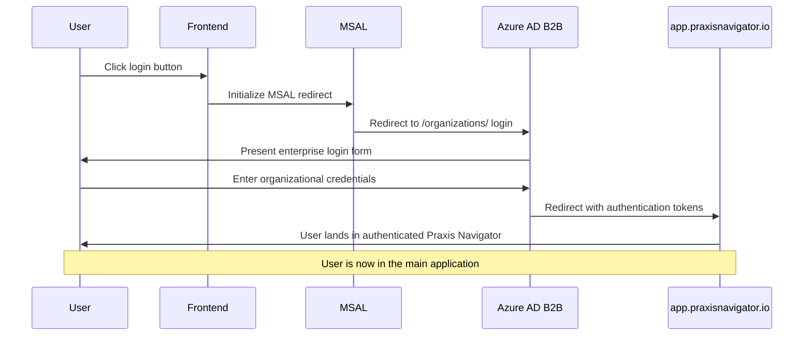

# Backend Architecture

Since this is a static website, the "backend" consists primarily of serverless functions and external service integrations.

## Service Architecture

### Function Organization

```
functions/
├── forms/
│   ├── submit.ts              # Form submission handler
│   ├── validate.ts            # Form validation utilities
│   └── hubspot.ts             # HubSpot CRM integration
├── marketplace/
│   └── redirect.ts            # Marketplace redirect handler  
├── utils/
│   ├── validation.ts          # Request validation
│   ├── cors.ts                # CORS handling
│   └── rate-limit.ts          # Rate limiting
└── types/
    └── cloudflare.ts          # Cloudflare Workers types
```

### Function Template

```typescript
// functions/forms/submit.ts
import { z } from 'zod';
import { leadSubmissionSchema } from '@/types/forms';
import { validateRequest } from '../utils/validation';
import { createHubSpotLead } from './hubspot';
import { rateLimiter } from '../utils/rate-limit';

interface Env {
  FORM_SUBMISSIONS: KVNamespace;
  HUBSPOT_API_KEY: string;
  HUBSPOT_PORTAL_ID: string;
}

export async function onRequest(context: EventContext<Env, string, any>) {
  const { request, env } = context;

  // Rate limiting
  const rateLimitResult = await rateLimiter.check(request, env);
  if (!rateLimitResult.allowed) {
    return new Response(JSON.stringify({
      success: false,
      error: { code: 'RATE_LIMITED', message: 'Too many requests' }
    }), { status: 429 });
  }

  // Validate request
  const validation = await validateRequest(request, leadSubmissionSchema);
  if (!validation.success) {
    return new Response(JSON.stringify({
      success: false,
      error: { code: 'VALIDATION_ERROR', message: validation.error }
    }), { status: 400 });
  }

  const leadData = validation.data;
  const leadId = `lead_${Date.now()}_${crypto.randomUUID().slice(0, 8)}`;

  try {
    // Store in KV for processing
    await env.FORM_SUBMISSIONS.put(leadId, JSON.stringify({
      id: leadId,
      timestamp: Date.now(),
      data: leadData,
      processed: false,
      retryCount: 0
    }), { expirationTtl: 604800 }); // 7 days

    // Create lead in HubSpot CRM
    await createHubSpotLead(leadData, env);

    return new Response(JSON.stringify({
      success: true,
      leadId,
      message: 'Thank you for your submission. We will contact you shortly.'
    }), {
      status: 200,
      headers: { 'Content-Type': 'application/json' }
    });

  } catch (error) {
    console.error('Form submission error:', error);
    return new Response(JSON.stringify({
      success: false,
      error: { code: 'INTERNAL_ERROR', message: 'Failed to process submission' }
    }), { status: 500 });
  }
}
```

## Authentication Architecture

### Auth Flow



---
