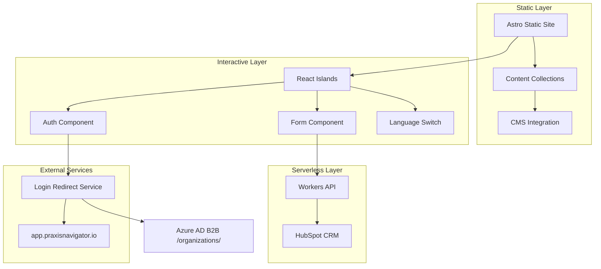

# Components

Based on the UX architecture and Praxis Design System, here are the major system components:

## Frontend Components

**Responsibility**: Render static pages with interactive islands for forms, authentication, and dynamic content

**Key Interfaces**:
- React component props with TypeScript interfaces
- Astro's component props system
- Praxis Design System CSS classes

**Dependencies**: Astro framework, React for islands, Praxis CSS theme, Tailwind utilities

**Technology Stack**: Astro static generation, React 18 with selective hydration, TypeScript strict mode, Tailwind CSS with custom Praxis theme

## Authentication Component

**Responsibility**: Handle Azure MSAL B2B authentication flows for enterprise customers and session management

**Key Interfaces**:
- **Azure Integration**: Direct login redirect to app.praxisnavigator.io with B2B SSO
- Azure AD B2B SSO integration for seamless application access
- Session state management across components

**Dependencies**: @azure/msal-browser, Zustand for state management, Cloudflare Workers for token handling

**Technology Stack**: MSAL Browser SDK, Azure AD B2B with /organizations/ endpoint, secure token storage in httpOnly cookies

## Form Processing Component

**Responsibility**: Handle lead generation forms with validation, submission, and follow-up workflows

**Key Interfaces**:
- React Hook Form validation schemas
- Cloudflare Workers API endpoints
- Email notification systems

**Dependencies**: React Hook Form, Zod validation, Cloudflare Workers, HubSpot CRM integration

**Technology Stack**: React Hook Form with TypeScript, Zod schemas, Cloudflare Workers serverless functions

## Content Management Component

**Responsibility**: Manage website content through headless CMS integration

**Key Interfaces**:
- CMS API for content retrieval
- Static generation build hooks
- Content preview workflows

**Dependencies**: Forestry/Sanity CMS, Astro content collections, build system triggers

**Technology Stack**: Headless CMS (Forestry), Astro content collections, automated build triggers

## Analytics & Monitoring Component

**Responsibility**: Track user interactions, performance metrics, and error reporting

**Key Interfaces**:
- Cloudflare Web Analytics API
- Sentry error reporting
- Custom event tracking

**Dependencies**: Cloudflare Analytics, Sentry SDK, GDPR compliance utilities

**Technology Stack**: Cloudflare Web Analytics (cookieless), Sentry for error tracking, custom event collection

## Component Diagrams

---
