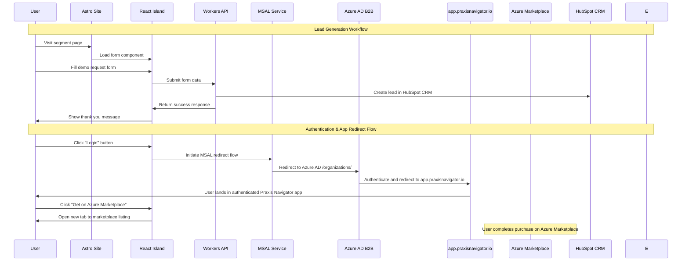

# Core Workflows

Key system workflows showing component interactions:

```mermaid
sequenceDiagram
    participant U as User
    participant A as Astro Site
    participant R as React Island
    participant W as Workers API
    participant M as MSAL Service
    participant AA as Azure AD B2B
    participant APP as app.praxisnavigator.io
    participant MP as Azure Marketplace
    participant H as HubSpot CRM

    Note over U,E: Lead Generation Workflow
    U->>A: Visit segment page
    A->>R: Load form component
    U->>R: Fill demo request form
    R->>W: Submit form data
    W->>H: Create lead in HubSpot CRM
    W->>R: Return success response
    R->>U: Show thank you message

    Note over U,E: Authentication & App Redirect Flow
    U->>R: Click "Login" button
    R->>M: Initiate MSAL redirect flow
    M->>AA: Redirect to Azure AD /organizations/
    AA->>APP: Authenticate and redirect to app.praxisnavigator.io
    APP->>U: User lands in authenticated Praxis Navigator app
    U->>R: Click "Get on Azure Marketplace"
    R->>U: Open new tab to marketplace listing
    Note over MP: User completes purchase on Azure Marketplace
```

---
