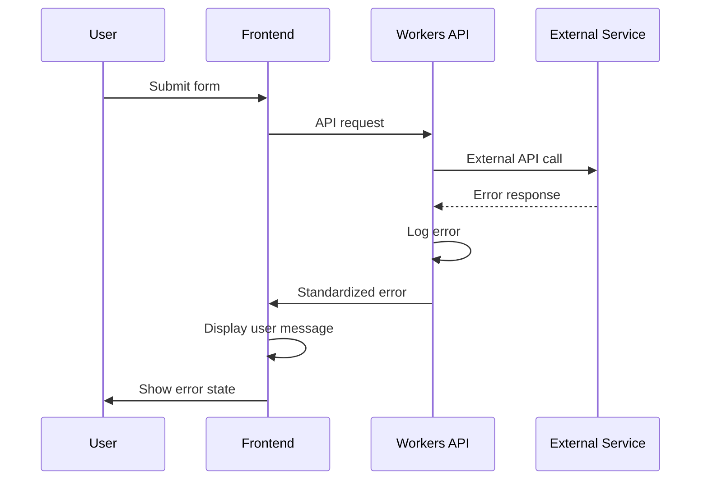

# Error Handling Strategy

## Error Flow



## Error Response Format

```typescript
interface ApiError {
  error: {
    code: string;
    message: string;
    details?: Record<string, any>;
    timestamp: string;
    requestId: string;
  };
}

// Example error codes
type ErrorCode = 
  | 'VALIDATION_ERROR'
  | 'RATE_LIMITED'
  | 'UNAUTHORIZED'
  | 'INTERNAL_ERROR'
  | 'NETWORK_ERROR'
  | 'SERVICE_UNAVAILABLE';
```

## Frontend Error Handling

```typescript
// utils/errorHandler.ts
export class ErrorHandler {
  static handleApiError(error: ApiError): string {
    const userMessages: Record<string, string> = {
      VALIDATION_ERROR: 'Please check your input and try again.',
      RATE_LIMITED: 'Too many requests. Please wait a moment and try again.',
      UNAUTHORIZED: 'Please log in to continue.',
      INTERNAL_ERROR: 'Something went wrong. Please try again later.',
      NETWORK_ERROR: 'Connection failed. Please check your internet connection.',
      SERVICE_UNAVAILABLE: 'Service is temporarily unavailable. Please try again later.'
    };

    return userMessages[error.error.code] || 'An unexpected error occurred.';
  }

  static logError(error: Error | ApiError, context?: string): void {
    if ('error' in error) {
      console.error(`API Error [${context}]:`, error.error);
      // Send to Sentry
      Sentry.captureException(error, { tags: { context } });
    } else {
      console.error(`Runtime Error [${context}]:`, error);
      Sentry.captureException(error, { tags: { context } });
    }
  }
}
```

## Backend Error Handling

```typescript
// functions/utils/errorHandler.ts
export class ApiErrorHandler {
  static createError(
    code: ErrorCode,
    message: string,
    details?: any,
    statusCode: number = 400
  ): Response {
    const error: ApiError = {
      error: {
        code,
        message,
        details,
        timestamp: new Date().toISOString(),
        requestId: crypto.randomUUID()
      }
    };

    console.error('API Error:', error);
    
    return new Response(JSON.stringify(error), {
      status: statusCode,
      headers: { 'Content-Type': 'application/json' }
    });
  }

  static handleUnexpectedError(error: unknown): Response {
    console.error('Unexpected error:', error);
    
    return this.createError(
      'INTERNAL_ERROR',
      'An unexpected error occurred',
      process.env.NODE_ENV === 'development' ? error : undefined,
      500
    );
  }
}
```

---
