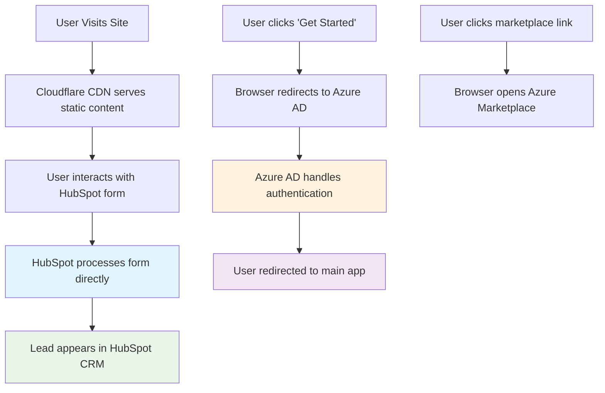

# External APIs

**Status**: Approved  
**Created**: 2025-08-20  
**Author**: Winston (Architect)  
**Last Updated**: 2025-08-20

## 📋 Overview

This document outlines the minimal external API dependencies for the Praxis Navigator promotional website. Following KISS principles, we use existing services rather than building custom integrations.

## 🎯 No Custom External APIs Needed

### Simplified Integration Strategy
The promotional website uses **zero custom external API integrations**. Instead, we leverage:

1. **HubSpot CRM**: Handles all form processing and lead management
2. **Azure AD B2B**: Simple redirect authentication (no API calls)
3. **Cloudflare Services**: Built-in analytics and hosting
4. **Static Content**: No dynamic API content needed

## 🛠️ Service Integrations (No APIs)

### HubSpot Forms Integration

**Type**: JavaScript Widget Embedding  
**No API calls required** - HubSpot handles everything client-side

```typescript
// Simple script inclusion - no API endpoints
interface HubSpotIntegration {
  scriptSrc: '//js.hsforms.net/forms/v2.js';
  portalId: string;
  formIds: {
    contact: string;
    demo: string;
  };
}
```

**What HubSpot Handles**:
- ✅ Form rendering and styling
- ✅ Input validation and error handling
- ✅ Spam protection and bot detection
- ✅ Lead capture and CRM storage
- ✅ Email notifications and workflows
- ✅ GDPR compliance and data processing
- ✅ Analytics and conversion tracking

### Azure AD B2B "Integration"

**Type**: URL Redirect  
**No API calls required** - Simple browser redirects

```typescript
// Static URL construction - no API endpoints
interface AzureADRedirect {
  baseUrl: 'https://login.microsoftonline.com/organizations/oauth2/v2.0/authorize';
  clientId: string; // Your Azure AD app client ID
  redirectUri: 'https://app.praxisnavigator.io';
  scope: 'openid profile email';
}
```

**What Azure AD Handles**:
- ✅ Enterprise authentication
- ✅ Multi-factor authentication
- ✅ Organizational policy enforcement
- ✅ Session management
- ✅ Token issuance and validation
- ✅ User directory integration

### Azure Marketplace "Integration"

**Type**: External Link  
**No API calls required** - Simple href links

```typescript
// Static URL links - no API endpoints
interface MarketplaceLinks {
  baseUrl: 'https://azuremarketplace.microsoft.com/marketplace/apps/praxis';
  utmTracking: {
    source: string;
    medium: string;
    campaign: string;
  };
}
```

**What Marketplace Handles**:
- ✅ Product listing and description
- ✅ Pricing and subscription management
- ✅ Customer purchasing workflow
- ✅ License provisioning
- ✅ Billing integration

## 📊 Analytics Integration (No APIs)

### Cloudflare Web Analytics

**Type**: JavaScript Widget  
**No API calls required** - Built-in with hosting

```typescript
// Automatic integration with Cloudflare Pages
interface CloudflareAnalytics {
  enabled: true; // Automatically enabled with Cloudflare Pages
  privacyFocused: true; // No cookies, GDPR compliant
  realTimeData: true; // Live visitor tracking
}
```

### HubSpot Tracking

**Type**: Automatic with Forms  
**No API calls required** - Built-in with HubSpot forms

```typescript
// Automatic visitor tracking
interface HubSpotTracking {
  visitorTracking: true; // Automatic with HubSpot script
  formAnalytics: true; // Built-in conversion tracking
  leadAttribution: true; // UTM parameter capture
}
```

## 🔄 Data Flow (No API Calls)



## 🎯 Benefits of No-API Approach

### Development Benefits
- ✅ **Zero Backend Code**: No serverless functions to maintain
- ✅ **No Error Handling**: External services handle all edge cases
- ✅ **No Rate Limiting**: No API quotas to manage
- ✅ **No Authentication**: No API keys to secure
- ✅ **No Monitoring**: No custom API health checks needed

### Security Benefits
- ✅ **Reduced Attack Surface**: No custom API endpoints to secure
- ✅ **Enterprise Security**: HubSpot and Azure handle security
- ✅ **No Data Storage**: No sensitive data stored on promotional site
- ✅ **Automatic Updates**: Service providers handle security patches

### Operational Benefits
- ✅ **Lower Costs**: No serverless function execution costs
- ✅ **Better Reliability**: Enterprise SLA from service providers
- ✅ **Automatic Scaling**: Services scale automatically
- ✅ **Built-in Compliance**: GDPR/SOC2 handled by providers

## 🚀 Implementation Checklist

### HubSpot Setup
- [ ] Create HubSpot account (already done)
- [ ] Create contact form in HubSpot
- [ ] Create demo request form in HubSpot
- [ ] Configure form styling to match brand
- [ ] Set up automated workflows
- [ ] Test form submissions

### Azure AD Setup
- [ ] Get Azure AD client ID for redirect URLs
- [ ] Configure redirect URI in Azure AD app registration
- [ ] Test authentication redirect flow

### Cloudflare Setup
- [ ] Enable Web Analytics in Cloudflare dashboard
- [ ] Configure custom domain
- [ ] Set up deployment from Git repository

### No Additional Setup Needed
- ❌ No API documentation to write
- ❌ No API testing to implement
- ❌ No rate limiting to configure
- ❌ No error monitoring to set up
- ❌ No authentication to implement
- ❌ No webhook endpoints to create

## 📈 Monitoring (Automatic)

### What's Monitored Automatically
- **Site Uptime**: Cloudflare handles monitoring and alerts
- **Form Submissions**: HubSpot provides form analytics
- **Authentication**: Azure AD provides auth analytics
- **Page Performance**: Cloudflare Web Analytics tracks Core Web Vitals

### What You Don't Need to Monitor
- ❌ API response times
- ❌ Error rates
- ❌ Database connectivity
- ❌ Queue processing
- ❌ External service health

## 🔗 Related Documentation

- [API Specification](./api-specification.md) - Simplified approach with HubSpot integration
- [HubSpot Setup Guide](../operations/hubspot-setup.md) - Detailed form configuration
- [Authentication Flow](../frontend/authentication.md) - Simple redirect implementation
- [Deployment](../operations/deployment.md) - Static site deployment

---

*This no-API approach eliminates integration complexity while providing enterprise-grade functionality through existing service providers, following KISS principles for maximum reliability and minimum maintenance.*
