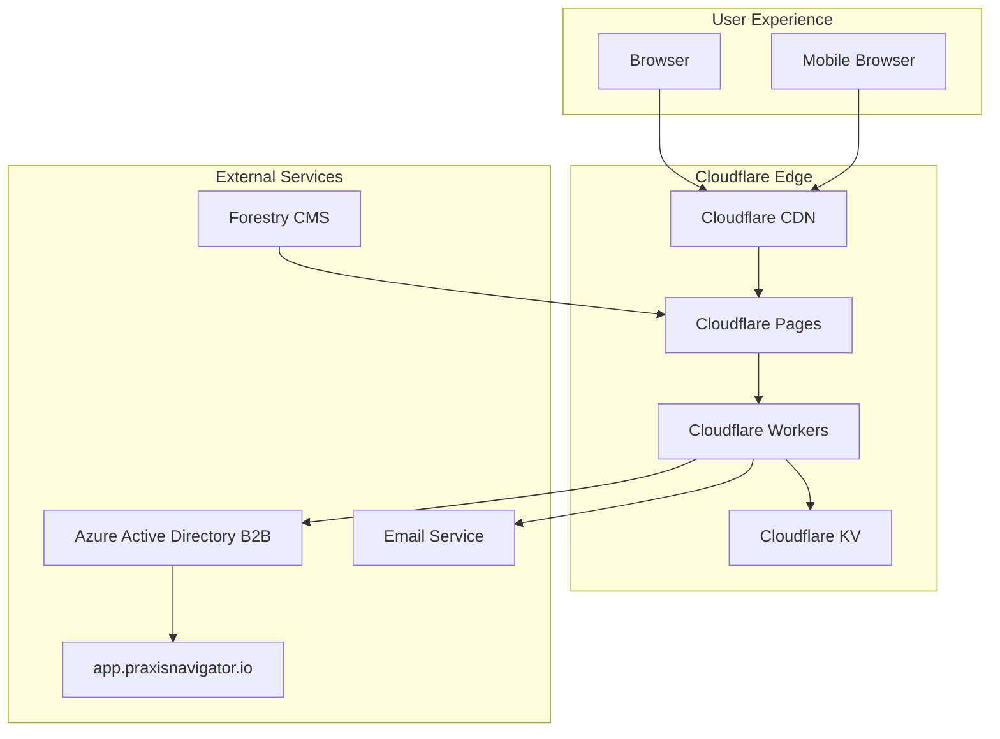
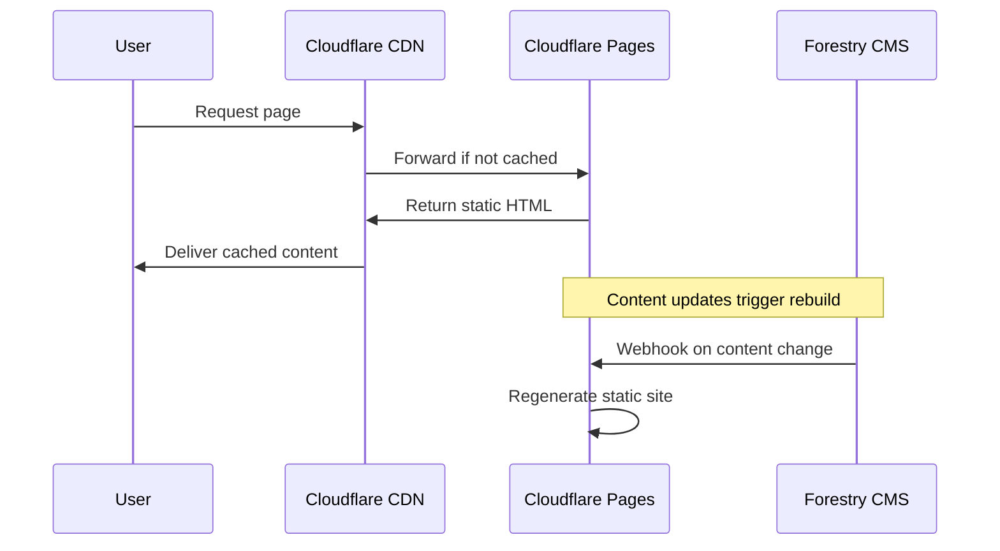
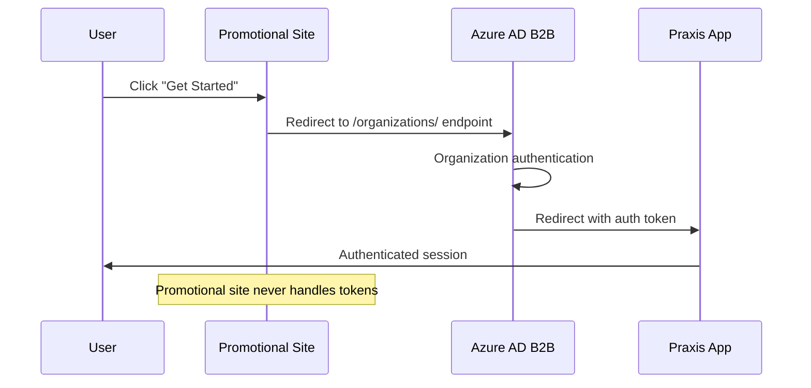
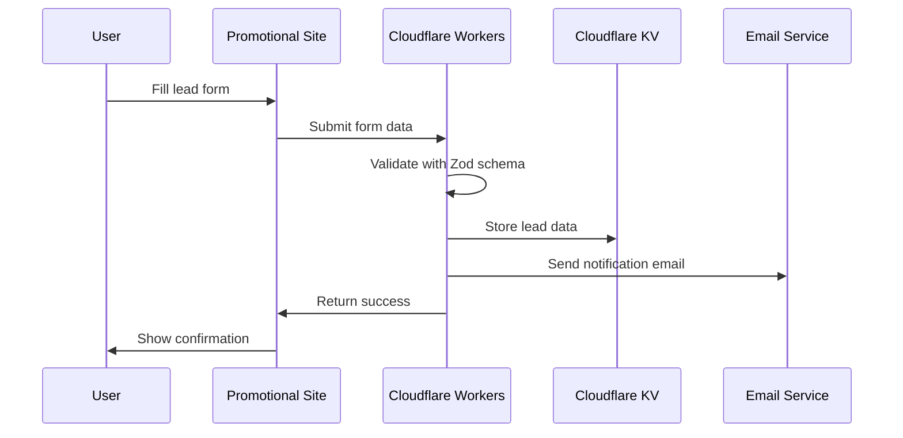

# High-Level Architecture

**Status**: Approved  
**Created**: 2025-08-20  
**Author**: Winston (Architect)  
**Last Updated**: 2025-08-20

## 📋 Overview

This document provides a high-level view of the Praxis Navigator promotional website architecture, focusing on system interactions, component relationships, and data flow patterns.

## 🏗️ Architecture Principles

### Jamstack Architecture
The promotional website follows Jamstack principles for optimal performance and security:

- **J**avaScript: React islands for selective interactivity
- **A**PIs: Serverless functions for form processing and external integrations  
- **M**arkup: Pre-built HTML generated at build time by Astro

### Edge-First Design
- **Global CDN**: Content delivered from edge locations worldwide
- **Edge Computing**: Serverless functions run close to users
- **Progressive Enhancement**: Core functionality works without JavaScript

## 🎯 System Overview

## 🔄 Core Component Interactions

### 1. Content Delivery Flow

### 2. Authentication Flow

### 3. Lead Capture Flow

## 🏛️ System Layers

### Presentation Layer (Frontend)
- **Technology**: Astro + React islands
- **Responsibility**: User interface, static content, interactive components
- **Performance**: Pre-rendered HTML with selective hydration
- **Styling**: Tailwind CSS with Praxis Design System

### Application Layer (Serverless)
- **Technology**: Cloudflare Workers
- **Responsibility**: Form processing, API integrations, business logic
- **Scalability**: Auto-scaling serverless functions
- **Geography**: Edge computing for global performance

### Data Layer (Edge Storage)
- **Technology**: Cloudflare KV + External APIs
- **Responsibility**: Temporary data storage, content management
- **Consistency**: Eventually consistent for non-critical data
- **Performance**: Edge storage for minimal latency

### Integration Layer (External)
- **Authentication**: Azure Active Directory B2B
- **Content**: Forestry CMS for non-technical updates
- **Email**: Integrated email service for notifications
- **Target App**: Praxis Navigator main application

## 🌊 Data Flow Architecture

### Content Flow
1. **Content Creation**: Non-technical team uses Forestry CMS
2. **Content Storage**: Git-based content management
3. **Build Trigger**: Webhook triggers Cloudflare Pages rebuild
4. **Static Generation**: Astro generates optimized HTML/CSS/JS
5. **Global Distribution**: CDN distributes to edge locations
6. **User Access**: Sub-2-second global load times

### User Interaction Flow
1. **Page Request**: User requests promotional page
2. **Static Delivery**: CDN serves pre-built HTML instantly
3. **Progressive Enhancement**: React islands hydrate for interactivity
4. **Form Submission**: Serverless functions process lead data
5. **Data Storage**: KV storage for temporary lead data
6. **Notifications**: Automated email workflows

### Authentication Flow
1. **Authentication Request**: User clicks authentication trigger
2. **External Redirect**: Redirect to Azure AD B2B endpoint
3. **Organization Auth**: Enterprise authentication handling
4. **Target Redirect**: Direct redirect to main Praxis application
5. **No Local State**: Promotional site never handles auth tokens

## 📊 Performance Architecture

### Caching Strategy
- **Static Assets**: Permanent caching for CSS/JS/images
- **HTML Pages**: Long-term caching with smart invalidation
- **API Responses**: Short-term caching for dynamic data
- **Edge Locations**: Global distribution for sub-2s load times

### Bundle Optimization
- **Code Splitting**: Separate bundles per page and component
- **Tree Shaking**: Remove unused code automatically
- **Island Architecture**: Load JavaScript only where needed
- **Lazy Loading**: Progressive loading of below-fold content

### Monitoring Points
- **Core Web Vitals**: Real user performance monitoring
- **Error Tracking**: Sentry for production error handling
- **Analytics**: Privacy-first Cloudflare Web Analytics
- **Uptime**: Cloudflare's built-in reliability monitoring

## 🔒 Security Architecture

### Frontend Security
- **Content Security Policy**: Strict CSP headers prevent XSS
- **No Inline Scripts**: All JavaScript through proper bundling
- **Input Sanitization**: React's built-in XSS protection
- **HTTPS Only**: All connections encrypted

### Backend Security
- **Input Validation**: Zod schemas validate all API inputs
- **Rate Limiting**: Prevent abuse of form endpoints
- **CORS Policy**: Restricted to approved domains only
- **No Sensitive Data**: Promotional site handles no secrets

### Authentication Security
- **External Handling**: Azure AD B2B manages all authentication
- **No Token Storage**: Promotional site never stores auth tokens
- **Secure Redirects**: HTTPS-only with proper validation
- **Enterprise Integration**: Leverages organizational security

## 🚀 Scalability Architecture

### Horizontal Scaling
- **Serverless Functions**: Auto-scaling based on demand
- **CDN Distribution**: Global edge network handles traffic spikes
- **Static Generation**: Pre-built content scales infinitely
- **Database**: Serverless KV storage auto-scales

### Performance Scaling
- **Edge Computing**: Functions run close to users globally
- **Caching Layers**: Multiple caching strategies reduce load
- **Bundle Optimization**: Minimal JavaScript for fast loading
- **Image Optimization**: WebP format with responsive sizing

## 🔄 Deployment Architecture

### Build Process
1. **Code Changes**: Push to main branch in Git
2. **Automatic Build**: Cloudflare Pages detects changes
3. **Static Generation**: Astro builds optimized static site
4. **Testing**: Automated tests run before deployment
5. **Global Deploy**: Instant deployment to edge locations

### Environment Strategy
- **Production**: main branch → production deployment
- **Preview**: Pull requests → preview deployments
- **Development**: Local development with hot reloading

## 🔗 Integration Points

### External Service Integration
- **Azure AD B2B**: Authentication provider (redirect only)
- **Forestry CMS**: Content management system
- **Email Service**: Lead notification system
- **Praxis App**: Target application for authenticated users

### API Integration Patterns
- **RESTful APIs**: Standard HTTP methods for form processing
- **Webhook Integration**: CMS triggers for content updates
- **Error Handling**: Graceful degradation for external service failures
- **Timeout Management**: Reasonable timeouts for all external calls

## 🔗 Related Documentation

- [Tech Stack](./tech-stack.md) - Detailed technology choices and rationale
- [Data Models](./data-models.md) - Complete data structure definitions
- [API Specification](./api-specification.md) - Serverless function endpoints
- [Frontend Architecture](../frontend/component-architecture.md) - React and Astro implementation
- [Deployment Strategy](../operations/deployment.md) - Cloudflare Pages deployment process

---

*This architecture is designed for enterprise-grade performance, security, and maintainability while remaining cost-effective and developer-friendly.*
