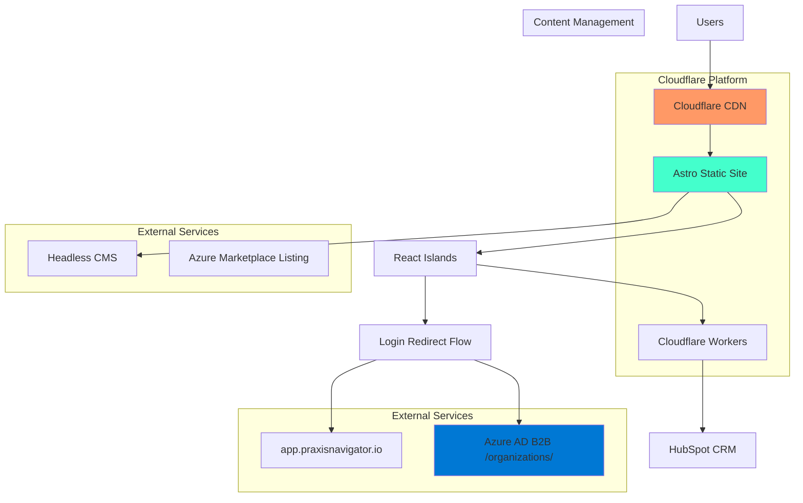

# High Level Architecture

## Technical Summary

The Praxis Navigator promotional website employs a modern **Jamstack architecture** using Astro as the static site generator with selective React hydration for interactive components. This approach delivers optimal performance through static generation while enabling dynamic features like form handling, language switching, and seamless login redirects to the main application. The frontend integrates with the Praxis Design System through Tailwind CSS theme configuration, ensuring pixel-perfect brand consistency. The architecture leverages Cloudflare Pages for deployment with integrated analytics, Azure AD B2B authentication flow for application login redirects, and direct marketplace links for seamless product signup flows. This stack achieves the PRD's performance goals (<2s load times, 99.9% uptime) while supporting enterprise-grade lead generation and conversion optimization workflows.

## Platform and Infrastructure Choice

**Platform**: Cloudflare Pages + Azure Services  
**Key Services**: 
- Cloudflare Pages (hosting, CDN, analytics)
- Cloudflare Workers (serverless functions for forms)
- Azure Active Directory B2B (MSAL-based login redirect to app.praxisnavigator.io) 
- Azure Marketplace (external product listing)
- Forestry/Sanity CMS (content management)

**Deployment Host and Regions**: Global edge deployment via Cloudflare with primary regions in US and EU for optimal performance to target markets

**Rationale**: This combination provides enterprise-grade performance and reliability while maintaining cost efficiency for a promotional website. Cloudflare's global CDN ensures <2s load times globally, while Azure B2B authentication flow enables seamless single sign-on transitions from the promotional website directly to the main Praxis Navigator application. The serverless approach eliminates infrastructure management overhead while providing scalability for traffic spikes during marketing campaigns.

## Repository Structure

**Structure**: Monorepo with workspace organization  
**Monorepo Tool**: npm workspaces (lightweight, no additional dependencies)  
**Package Organization**: 
- `/apps/website` - Main Astro application
- `/packages/ui` - Praxis design system components  
- `/packages/shared` - TypeScript types and utilities
- `/apps/cms` - Content management setup (if needed)

## High Level Architecture Diagram

## Architectural Patterns

- **Jamstack Architecture**: Static site generation with serverless functions - *Rationale*: Optimal performance, security, and scalability for content-heavy promotional sites
- **Island Architecture**: Selective hydration of React components - *Rationale*: Minimizes JavaScript bundle size while enabling interactivity where needed  
- **Component-Based UI**: Reusable React components with TypeScript - *Rationale*: Maintainability and consistency with Praxis Design System
- **Edge-First Deployment**: Global CDN with edge computing - *Rationale*: Sub-2-second load times globally as required by PRD
- **Headless CMS Pattern**: Content separation from presentation - *Rationale*: Enables content updates without developer deployment
- **Progressive Enhancement**: Base functionality without JavaScript - *Rationale*: Accessibility and SEO optimization for enterprise users

---
