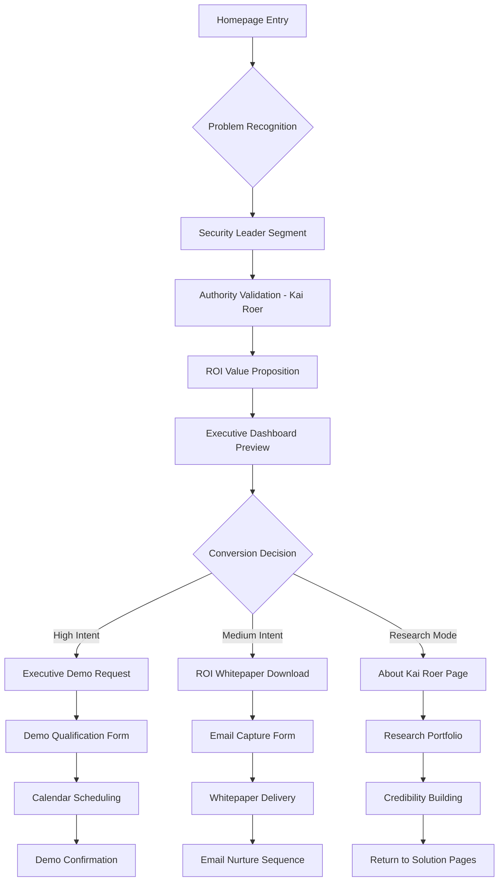
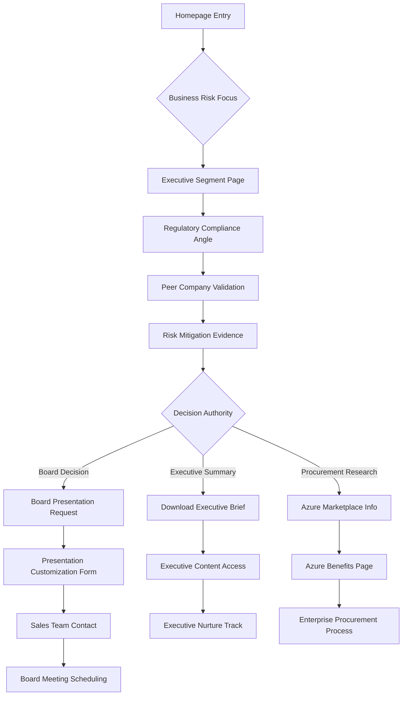
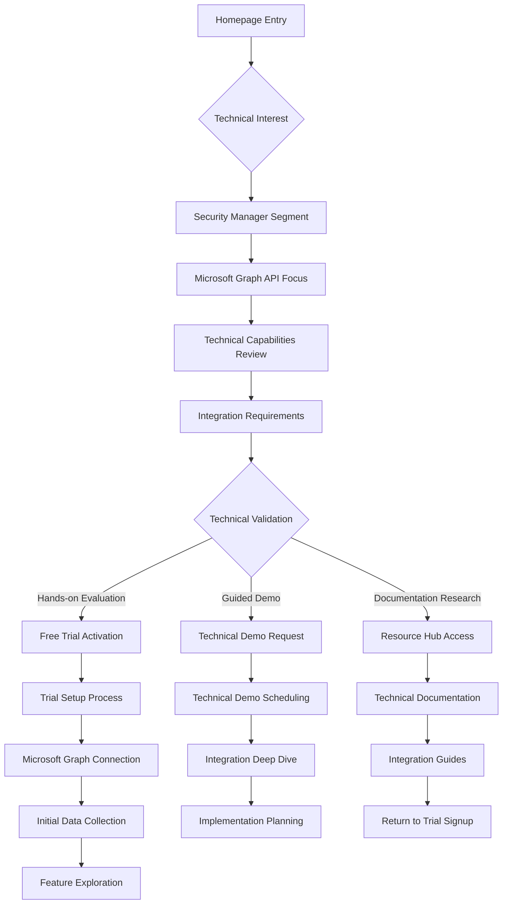
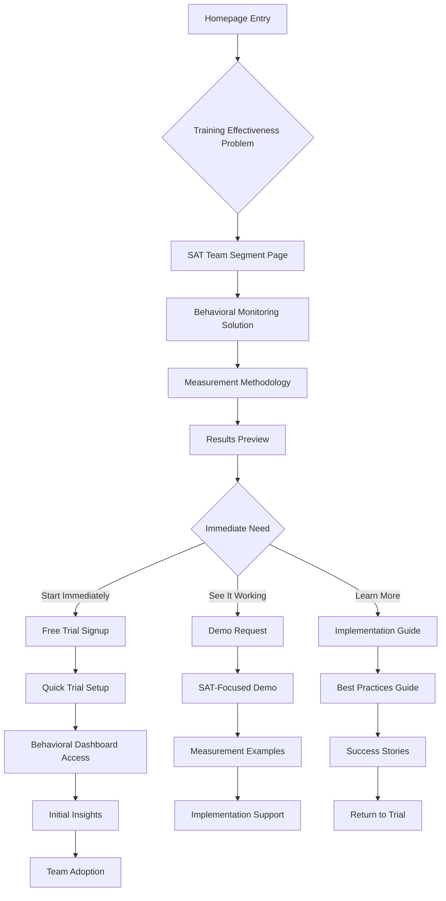

# User Flow Diagrams

## Flow 1: Security Leader Journey (CISO/Security Director)

## Flow 2: Board/Executive Decision Journey

## Flow 3: Technical Evaluation Journey (Security Managers)

## Flow 4: SAT Team Journey

---
