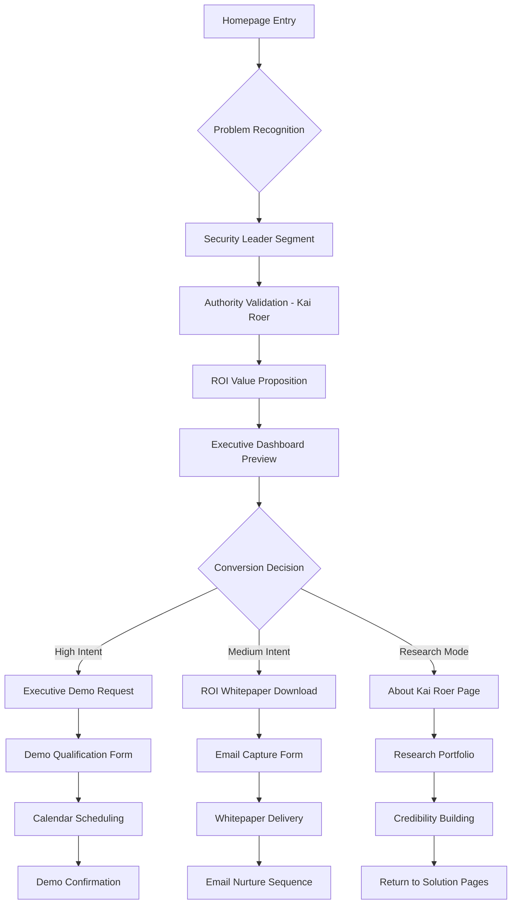
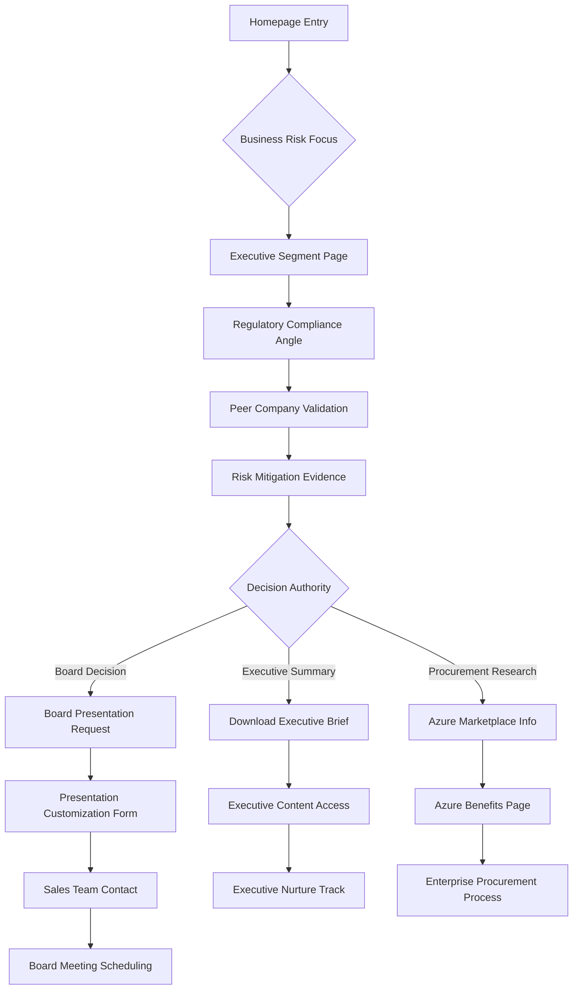
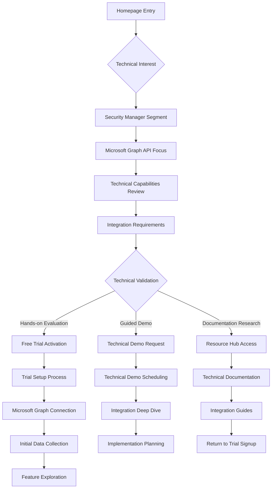
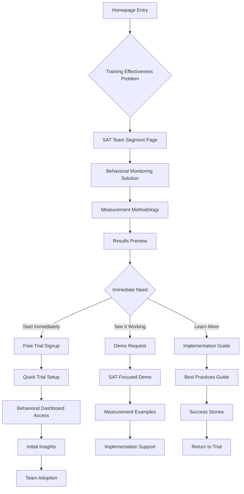

# Praxis Navigator - Detailed Wireframes & User Flow Diagrams

## User Flow Diagrams

### Flow 1: Security Leader Journey (CISO/Security Director)



### Flow 2: Board/Executive Decision Journey



### Flow 3: Technical Evaluation Journey (Security Managers)



### Flow 4: SAT Team Journey



---

## Detailed Page Wireframes

### Homepage Detailed Wireframe

```
┌──────────────────────────────────────────────────────────────────────────────┐
│ HEADER NAVIGATION                                                            │
│ ┌─────────────────────────────────────────────────────────────────────────┐  │
│ │ [PRAXIS LOGO]     Product  Segments  About  Resources  Pricing  Contact │  │
│ │                                                    [NO|EN] [LOGIN] [AZURE]│  │
│ └─────────────────────────────────────────────────────────────────────────┘  │
├──────────────────────────────────────────────────────────────────────────────┤
│ HERO SECTION (Height: 600px, Background: praxis-dark-blue gradient)         │
│ ┌────────────────────────────────────┐ ┌────────────────────────────────────┐ │
│ │ HEADLINE (h1, 3.5rem, white):     │ │                                    │ │
│ │ "MEASURE WHAT MATTERS:             │ │    PRODUCT PREVIEW                 │ │
│ │  ACTUAL SECURITY BEHAVIORS"        │ │ ┌────────────────────────────────┐ │ │
│ │                                    │ │ │ [DASHBOARD MOCKUP IMAGE]       │ │ │
│ │ SUBHEADLINE (h3, 1.5rem, gold):   │ │ │ • Behavioral Analytics         │ │ │
│ │ "By Kai Roer, Creator of the       │ │ │ • Risk Scoring                 │ │ │
│ │  Security Culture Framework        │ │ │ • Compliance Tracking          │ │ │
│ │  adopted by ENISA"                 │ │ │ • Executive Reporting          │ │ │
│ │                                    │ │ └────────────────────────────────┘ │ │
│ │ PROBLEM STATEMENT (body-large):    │ │                                    │ │
│ │ "Organizations invest heavily in   │ │                                    │ │
│ │ Security Awareness Training but    │ │                                    │ │
│ │ can't measure behavioral changes"  │ │                                    │ │
│ │                                    │ │                                    │ │
│ │ CTA BUTTONS:                       │ │                                    │ │
│ │ [SCHEDULE DEMO] [START FREE TRIAL] │ │                                    │ │
│ │  btn-accent      btn-primary       │ │                                    │ │
│ └────────────────────────────────────┘ └────────────────────────────────────┘ │
├──────────────────────────────────────────────────────────────────────────────┤
│ AUTHORITY SECTION (Background: praxis-white, Padding: 5rem 0)               │
│ ┌──────────────────────────────────────────────────────────────────────────┐ │
│ │ SECTION HEADLINE (h2, center, praxis-dark-blue):                        │ │
│ │ "FROM THE MIND BEHIND THE SECURITY CULTURE FRAMEWORK"                   │ │
│ │                                                                          │ │
│ │ ┌─────────────────┐ ┌──────────────────────────────────────────────────┐ │ │
│ │ │ [KAI ROER       │ │ CREDENTIALS (h5, praxis-blue):                   │ │ │
│ │ │  PROFESSIONAL   │ │ • Creator, Security Culture Framework (ENISA)   │ │ │
│ │ │  HEADSHOT]      │ │ • Co-author, "Security Culture Playbook" (Wiley)│ │ │
│ │ │ 150x150px       │ │ • Former Chief Research Officer, KnowBe4         │ │ │
│ │ │ rounded-full    │ │ • Founder, CLTRe (acquired by KnowBe4)           │ │ │
│ │ │                 │ │ • Ron Knode Service Award, Cloud Security Alliance│ │ │
│ │ └─────────────────┘ │ • 25+ years cybersecurity research experience    │ │ │
│ │                     └──────────────────────────────────────────────────┘ │ │
│ │                                                                          │ │
│ │ AUTHORITY STATEMENT (body-large, italic, praxis-blue, center):           │ │
│ │ "Kai Roer's research-backed approach to security culture transformation  │ │
│ │  provides the credible foundation enterprises require for this critical  │ │
│ │  investment in behavioral security monitoring."                          │ │
│ │                                                                          │ │
│ │ [LEARN MORE ABOUT KAI'S RESEARCH] - btn-outline                         │ │
│ └──────────────────────────────────────────────────────────────────────────┘ │
├──────────────────────────────────────────────────────────────────────────────┤
│ SEGMENT SELECTION (Background: praxis-gold-50, Padding: 4rem 0)             │
│ ┌──────────────────────────────────────────────────────────────────────────┐ │
│ │ SECTION HEADLINE (h2, center):                                          │ │
│ │ "SOLUTIONS FOR YOUR ROLE"                                               │ │
│ │                                                                          │ │
│ │ ┌─────────────┐ ┌─────────────┐ ┌─────────────┐ ┌─────────────┐        │ │
│ │ │ SECURITY    │ │ BOARD &     │ │ SECURITY    │ │ SAT TEAMS   │        │ │
│ │ │ LEADERS     │ │ C-SUITE     │ │ MANAGERS    │ │             │        │ │
│ │ │             │ │             │ │             │ │             │        │ │
│ │ │ [SHIELD     │ │ [CHART      │ │ [SETTINGS   │ │ [USERS      │        │ │
│ │ │  ICON]      │ │  ICON]      │ │  ICON]      │ │  ICON]      │        │ │
│ │ │ icon-xl     │ │ icon-xl     │ │ icon-xl     │ │ icon-xl     │        │ │
│ │ │             │ │             │ │             │ │             │        │ │
│ │ │ "ROI & Risk │ │ "Business   │ │ "Technical  │ │ "Training   │        │ │
│ │ │ Reporting"  │ │ Compliance" │ │ Integration"│ │ Measurement"│        │ │
│ │ │             │ │             │ │             │ │             │        │ │
│ │ │ [VIEW       │ │ [VIEW       │ │ [VIEW       │ │ [VIEW       │        │ │
│ │ │ SOLUTIONS]  │ │ SOLUTIONS]  │ │ SOLUTIONS]  │ │ SOLUTIONS]  │        │ │
│ │ │ btn-outline │ │ btn-outline │ │ btn-outline │ │ btn-outline │        │ │
│ │ └─────────────┘ └─────────────┘ └─────────────┘ └─────────────┘        │ │
│ └──────────────────────────────────────────────────────────────────────────┘ │
├──────────────────────────────────────────────────────────────────────────────┤
│ PROBLEM/SOLUTION FIT (Background: praxis-white, Padding: 5rem 0)            │
│ ┌──────────────────────────────────────────────────────────────────────────┐ │
│ │ SECTION HEADLINE (h2, center):                                          │ │
│ │ "THE SECURITY AWARENESS TRAINING BLIND SPOT"                            │ │
│ │                                                                          │ │
│ │ ┌─────────────────────────────────┐ ┌─────────────────────────────────┐  │ │
│ │ │ BEFORE (card-danger):           │ │ AFTER (card-accent):            │  │ │
│ │ │                                 │ │                                 │  │ │
│ │ │ [TRAINING ICON with X]          │ │ [ANALYTICS DASHBOARD ICON]      │  │ │
│ │ │                                 │ │                                 │  │ │
│ │ │ "Organizations invest in:       │ │ "Praxis Navigator provides:     │  │ │
│ │ │ • Security Awareness Training  │ │ • Actual behavior measurement   │  │ │
│ │ │ • Phishing simulations         │ │ • Microsoft Graph API data     │  │ │
│ │ │ • Compliance reporting         │ │ • Real-time risk scoring        │  │ │
│ │ │                                 │ │ • Behavioral change tracking   │  │ │
│ │ │ BUT CANNOT MEASURE:             │ │                                 │  │ │
│ │ │ ❌ Behavioral improvements      │ │ ✅ Evidence-based reporting     │  │ │
│ │ │ ❌ Real-world application       │ │ ✅ Continuous monitoring        │  │ │
│ │ │ ❌ Investment effectiveness     │ │ ✅ ROI quantification           │  │ │
│ │ └─────────────────────────────────┘ └─────────────────────────────────┘  │ │
│ │                                                                          │ │
│ │ [LEARN HOW IT WORKS] - btn-primary, centered                            │ │
│ └──────────────────────────────────────────────────────────────────────────┘ │
├──────────────────────────────────────────────────────────────────────────────┤
│ SOCIAL PROOF SECTION (Background: praxis-dark-blue-50, Padding: 4rem 0)     │
│ ┌──────────────────────────────────────────────────────────────────────────┐ │
│ │ HEADLINE (h3, center):                                                  │ │
│ │ "TRUSTED BY SECURITY LEADERS WORLDWIDE"                                 │ │
│ │                                                                          │ │
│ │ CUSTOMER LOGOS (grayscale, hover:color):                                │ │
│ │ [LOGO1] [LOGO2] [LOGO3] [LOGO4] [LOGO5] [LOGO6]                        │ │
│ │                                                                          │ │
│ │ TESTIMONIAL HIGHLIGHT:                                                   │ │
│ │ ┌──────────────────────────────────────────────────────────────────────┐ │ │
│ │ │ "Praxis Navigator finally gives us the behavioral evidence we need   │ │ │
│ │ │  to prove our security training investments are working."            │ │ │
│ │ │                                                                      │ │ │
│ │ │ - [NAME], CISO, [COMPANY]                                           │ │ │
│ │ │   [CUSTOMER PHOTO] testimonial attribution                          │ │ │
│ │ └──────────────────────────────────────────────────────────────────────┘ │ │
│ │                                                                          │ │
│ │ [READ more customer stories] - btn-ghost                                │ │
│ └──────────────────────────────────────────────────────────────────────────┘ │
├──────────────────────────────────────────────────────────────────────────────┤
│ FINAL CTA SECTION (Background: praxis-gold gradient, Padding: 4rem 0)       │
│ ┌──────────────────────────────────────────────────────────────────────────┐ │
│ │ HEADLINE (h2, center, praxis-dark-blue):                               │ │
│ │ "START MEASURING SECURITY BEHAVIORS TODAY"                              │ │
│ │                                                                          │ │
│ │ SUBHEADLINE (body-large, center):                                       │ │
│ │ "Join hundreds of organizations using Praxis Navigator to prove         │ │
│ │  the effectiveness of their security awareness programs."               │ │
│ │                                                                          │ │
│ │ CTA BUTTONS (center, space-x-4):                                        │ │
│ │ [START 30-DAY FREE TRIAL] [SCHEDULE EXECUTIVE DEMO]                     │ │
│ │  btn-primary btn-lg           btn-outline btn-lg                        │ │
│ │                                                                          │ │
│ │ AZURE MARKETPLACE LINK:                                                  │ │
│ │ [🚀 Available on Azure Marketplace] - btn-secondary                     │ │
│ └──────────────────────────────────────────────────────────────────────────┘ │
└──────────────────────────────────────────────────────────────────────────────┘
```

### Security Leaders Segment Page Wireframe

```
┌──────────────────────────────────────────────────────────────────────────────┐
│ HEADER NAVIGATION (same as homepage)                                         │
├──────────────────────────────────────────────────────────────────────────────┤
│ BREADCRUMB NAVIGATION                                                        │
│ ┌──────────────────────────────────────────────────────────────────────────┐ │
│ │ Home > Solutions > Security Leaders                                      │ │
│ └──────────────────────────────────────────────────────────────────────────┘ │
├──────────────────────────────────────────────────────────────────────────────┤
│ HERO SECTION (Background: praxis-dark-blue gradient, Height: 500px)         │
│ ┌────────────────────────────────────┐ ┌────────────────────────────────────┐ │
│ │ HEADLINE (h1, white):              │ │                                    │ │
│ │ "PROVE SAT INVESTMENT ROI          │ │    EXECUTIVE DASHBOARD PREVIEW     │ │
│ │  WITH BEHAVIORAL EVIDENCE"         │ │ ┌────────────────────────────────┐ │ │
│ │                                    │ │ │ [EXECUTIVE METRICS MOCKUP]     │ │ │
│ │ PAIN POINTS (h4, praxis-gold):     │ │ │                                │ │ │
│ │ Current Challenges:                │ │ │ ROI Metrics:                   │ │ │
│ │ • No behavioral measurement        │ │ │ • 47% Risk Reduction           │ │ │
│ │ • Executive accountability gaps    │ │ │ • $2.3M Avoided Costs          │ │ │
│ │ • Compliance uncertainty          │ │ │ • 89% Behavior Improvement      │ │ │
│ │ • Investment justification        │ │ │                                │ │ │
│ │                                    │ │ │ Board-Ready Reports:           │ │ │
│ │ AUTHORITY REFERENCE:               │ │ │ • Quarterly Risk Assessment    │ │ │
│ │ "Built on 25+ years of security   │ │ │ • Compliance Status            │ │ │
│ │ culture research by Kai Roer"      │ │ │ • Training Effectiveness       │ │ │
│ │                                    │ │ └────────────────────────────────┘ │ │
│ │ [EXECUTIVE DEMO REQUEST]           │ │                                    │ │
│ │  btn-accent btn-lg                 │ │                                    │ │
│ └────────────────────────────────────┘ └────────────────────────────────────┘ │
├──────────────────────────────────────────────────────────────────────────────┤
│ VALUE PROPOSITIONS (Background: praxis-white, Padding: 4rem 0)              │
│ ┌──────────────────────────────────────────────────────────────────────────┐ │
│ │ SECTION HEADLINE (h2, center):                                          │ │
│ │ "EXECUTIVE-READY SECURITY BEHAVIOR ANALYTICS"                           │ │
│ │                                                                          │ │
│ │ ┌─────────────────┐ ┌─────────────────┐ ┌─────────────────┐            │ │
│ │ │ ROI MEASUREMENT │ │ EXECUTIVE       │ │ COMPLIANCE      │            │ │
│ │ │ (card-primary)  │ │ REPORTING       │ │ EVIDENCE        │            │ │
│ │ │                 │ │ (card-accent)   │ │ (card-primary)  │            │ │
│ │ │ [ANALYTICS ICON]│ │ [CHART ICON]    │ │ [SHIELD ICON]   │            │ │
│ │ │                 │ │                 │ │                 │            │ │
│ │ │ "Quantify the   │ │ "Board-ready    │ │ "Demonstrate    │            │ │
│ │ │ behavioral      │ │ dashboards and  │ │ compliance with │            │ │
│ │ │ impact of your  │ │ executive       │ │ NIS2, cyber     │            │ │
│ │ │ SAT investments"│ │ summaries"      │ │ insurance reqs" │            │ │
│ │ │                 │ │                 │ │                 │            │ │
│ │ │ • Risk reduction│ │ • KPI tracking  │ │ • Audit trails  │            │ │
│ │ │ • Cost analysis │ │ • Trend reports │ │ • Evidence docs │            │ │
│ │ │ • Behavior data │ │ • Risk scoring  │ │ • Policy align  │            │ │
│ │ └─────────────────┘ └─────────────────┘ └─────────────────┘            │ │
│ └──────────────────────────────────────────────────────────────────────────┘ │
├──────────────────────────────────────────────────────────────────────────────┤
│ USE CASE SCENARIOS (Background: praxis-gold-50, Padding: 4rem 0)            │
│ ┌──────────────────────────────────────────────────────────────────────────┐ │
│ │ SECTION HEADLINE (h2):                                                  │ │
│ │ "REAL-WORLD SCENARIOS FOR SECURITY LEADERS"                             │ │
│ │                                                                          │ │
│ │ SCENARIO 1 (card-hoverable):                                            │ │
│ │ ┌──────────────────────────────────────────────────────────────────────┐ │ │
│ │ │ SCENARIO TITLE (h4): "Board Quarterly Review"                       │ │ │
│ │ │                                                                      │ │ │
│ │ │ SITUATION:                                                           │ │ │
│ │ │ "The board requires evidence that our $500K annual SAT investment   │ │ │
│ │ │  is reducing actual security risk, not just test scores."           │ │ │
│ │ │                                                                      │ │ │
│ │ │ PRAXIS SOLUTION:                                                     │ │ │
│ │ │ • Real behavioral data from Microsoft Graph API                     │ │ │
│ │ │ • 47% reduction in risky behaviors over 6 months                    │ │ │
│ │ │ • $2.3M in potential breach costs avoided                           │ │ │
│ │ │ • Board-ready quarterly executive summary                           │ │ │
│ │ │                                                                      │ │ │
│ │ │ [VIEW SAMPLE BOARD REPORT] - btn-outline-accent                     │ │ │
│ │ └──────────────────────────────────────────────────────────────────────┘ │ │
│ │                                                                          │ │
│ │ SCENARIO 2 (card-hoverable):                                            │ │
│ │ ┌──────────────────────────────────────────────────────────────────────┐ │ │
│ │ │ SCENARIO TITLE (h4): "Cyber Insurance Audit"                        │ │ │
│ │ │                                                                      │ │ │
│ │ │ SITUATION:                                                           │ │ │
│ │ │ "Insurance auditors need evidence of effective security awareness   │ │ │
│ │ │  training beyond completion rates and phishing test results."       │ │ │
│ │ │                                                                      │ │ │
│ │ │ PRAXIS SOLUTION:                                                     │ │ │
│ │ │ • Continuous behavioral monitoring data                             │ │ │
│ │ │ • Measurable improvement in security practices                      │ │ │
│ │ │ • Compliance with industry frameworks                               │ │ │
│ │ │ • Auditor-ready documentation package                               │ │ │
│ │ │                                                                      │ │ │
│ │ │ [DOWNLOAD COMPLIANCE GUIDE] - btn-outline-accent                    │ │ │
│ │ └──────────────────────────────────────────────────────────────────────┘ │ │
│ └──────────────────────────────────────────────────────────────────────────┘ │
├──────────────────────────────────────────────────────────────────────────────┤
│ SOCIAL PROOF & TESTIMONIALS (Background: praxis-white, Padding: 4rem 0)     │
│ ┌──────────────────────────────────────────────────────────────────────────┐ │
│ │ SECTION HEADLINE (h3, center):                                          │ │
│ │ "TRUSTED BY SECURITY LEADERS AT LEADING ORGANIZATIONS"                  │ │
│ │                                                                          │ │
│ │ TESTIMONIAL CARDS:                                                       │ │
│ │ ┌─────────────────────────────┐ ┌─────────────────────────────┐          │ │
│ │ │ TESTIMONIAL 1:              │ │ TESTIMONIAL 2:              │          │ │
│ │ │                             │ │                             │          │ │
│ │ │ "Praxis Navigator gave us   │ │ "Finally, behavioral data   │          │ │
│ │ │ the ROI evidence we needed  │ │ that proves our training    │          │ │
│ │ │ to justify expanding our    │ │ is working. Board loves     │          │ │
│ │ │ security awareness program" │ │ the quarterly reports."     │          │ │
│ │ │                             │ │                             │          │ │
│ │ │ [PHOTO] John Smith          │ │ [PHOTO] Sarah Johnson       │          │ │
│ │ │ CISO, TechCorp (5000+ emp)  │ │ Security Dir, FinanceInc    │          │ │
│ │ └─────────────────────────────┘ └─────────────────────────────┘          │ │
│ │                                                                          │ │
│ │ ENTERPRISE CUSTOMER LOGOS (logo-sm, opacity-70):                        │ │
│ │ [FORTUNE500-1] [FORTUNE500-2] [FORTUNE500-3] [FORTUNE500-4]             │ │
│ └──────────────────────────────────────────────────────────────────────────┘ │
├──────────────────────────────────────────────────────────────────────────────┤
│ CONVERSION SECTION (Background: praxis-dark-blue, Padding: 4rem 0)          │
│ ┌──────────────────────────────────────────────────────────────────────────┐ │
│ │ HEADLINE (h2, center, white):                                           │ │
│ │ "GET EXECUTIVE-READY SAT ROI ANALYSIS"                                  │ │
│ │                                                                          │ │
│ │ SUBHEADLINE (body-large, center, praxis-gold):                          │ │
│ │ "See how behavioral evidence transforms your security program           │ │
│ │  from cost center to strategic advantage"                               │ │
│ │                                                                          │ │
│ │ VALUE STACK (center):                                                    │ │
│ │ ✅ Custom ROI analysis for your organization                            │ │
│ │ ✅ Board-ready presentation materials                                    │ │
│ │ ✅ 30-day risk-free trial on Azure Marketplace                          │ │
│ │ ✅ Executive demo with security culture expert                           │ │
│ │                                                                          │ │
│ │ CTA BUTTONS (center, space-x-4):                                        │ │
│ │ [SCHEDULE EXECUTIVE DEMO] [START AZURE TRIAL]                           │ │
│ │  btn-accent btn-xl            btn-secondary btn-xl                      │ │
│ │                                                                          │ │
│ │ TRUST INDICATORS:                                                        │ │
│ │ 🔒 Enterprise security • 📊 GDPR compliant • 🏆 SOC2 certified          │ │
│ └──────────────────────────────────────────────────────────────────────────┘ │
└──────────────────────────────────────────────────────────────────────────────┘
```

### Product Overview Page Wireframe

```
┌──────────────────────────────────────────────────────────────────────────────┐
│ HEADER + BREADCRUMB (same pattern)                                          │
├──────────────────────────────────────────────────────────────────────────────┤
│ HERO SECTION (Background: praxis-blue gradient, Height: 400px)              │
│ ┌──────────────────────────────────────────────────────────────────────────┐ │
│ │ HEADLINE (h1, center, white):                                           │ │
│ │ "MICROSOFT GRAPH API BEHAVIORAL SECURITY MONITORING"                    │ │
│ │                                                                          │ │
│ │ SUBHEADLINE (h3, center, praxis-gold):                                  │ │
│ │ "Continuous measurement of actual security behaviors                     │ │
│ │  without disrupting employee workflows"                                  │ │
│ │                                                                          │ │
│ │ [SEE HOW IT WORKS] - btn-accent btn-lg                                  │ │
│ └──────────────────────────────────────────────────────────────────────────┘ │
├──────────────────────────────────────────────────────────────────────────────┤
│ HOW IT WORKS SECTION (Background: praxis-white, Padding: 5rem 0)            │
│ ┌──────────────────────────────────────────────────────────────────────────┐ │
│ │ SECTION HEADLINE (h2, center):                                          │ │
│ │ "THREE-STEP BEHAVIORAL MONITORING PROCESS"                              │ │
│ │                                                                          │ │
│ │ PROCESS FLOW:                                                            │ │
│ │ ┌─────────────────┐     ┌─────────────────┐     ┌─────────────────┐    │ │
│ │ │ STEP 1          │ ──→ │ STEP 2          │ ──→ │ STEP 3          │    │ │
│ │ │                 │     │                 │     │                 │    │ │
│ │ │ [API ICON]      │     │ [ANALYTICS ICON]│     │ [REPORT ICON]   │    │ │
│ │ │                 │     │                 │     │                 │    │ │
│ │ │ "CONNECT TO     │     │ "ANALYZE        │     │ "GENERATE       │    │ │
│ │ │ MICROSOFT GRAPH"│     │ BEHAVIORS"      │     │ INSIGHTS"       │    │ │
│ │ │                 │     │                 │     │                 │    │ │
│ │ │ • Secure OAuth  │     │ • Risk scoring  │     │ • Executive     │    │ │
│ │ │ • Read-only     │     │ • Trend analysis│     │   dashboards    │    │ │
│ │ │ • Zero setup    │     │ • Benchmarking  │     │ • Compliance    │    │ │
│ │ │ • Real-time     │     │ • Alerting      │     │   reports       │    │ │
│ │ └─────────────────┘     └─────────────────┘     └─────────────────┘    │ │
│ └──────────────────────────────────────────────────────────────────────────┘ │
├──────────────────────────────────────────────────────────────────────────────┤
│ MICROSOFT GRAPH INTEGRATION (Background: praxis-sky-50, Padding: 4rem 0)    │
│ ┌──────────────────────────────────────────────────────────────────────────┐ │
│ │ SECTION HEADLINE (h2):                                                  │ │
│ │ "POWERED BY MICROSOFT GRAPH API"                                        │ │
│ │                                                                          │ │
│ │ ┌────────────────────────────────────┐ ┌────────────────────────────────┐ │ │
│ │ │ DATA SOURCES (card-primary):       │ │ SECURITY & PRIVACY:            │ │ │
│ │ │                                    │ │                                │ │ │
│ │ │ [MICROSOFT GRAPH LOGO]             │ │ [SHIELD ICON]                  │ │ │
│ │ │                                    │ │                                │ │ │
│ │ │ Behavioral Data Collected:         │ │ Privacy-First Approach:        │ │ │
│ │ │ • Email security practices         │ │ • No PII collection            │ │ │
│ │ │ • File sharing behaviors           │ │ • Encrypted data transmission  │ │ │
│ │ │ • Authentication patterns          │ │ • SOC2 Type II compliant       │ │ │
│ │ │ • Device compliance               │ │ • GDPR aligned                 │ │ │
│ │ │ • Security alert responses        │ │ • Read-only API access         │ │ │
│ │ │                                    │ │ • Zero workflow disruption    │ │ │
│ │ └────────────────────────────────────┘ └────────────────────────────────┘ │ │
│ └──────────────────────────────────────────────────────────────────────────┘ │
├──────────────────────────────────────────────────────────────────────────────┤
│ FEATURES & CAPABILITIES (Background: praxis-white, Padding: 5rem 0)         │
│ ┌──────────────────────────────────────────────────────────────────────────┐ │
│ │ SECTION HEADLINE (h2, center):                                          │ │
│ │ "COMPREHENSIVE BEHAVIORAL ANALYTICS PLATFORM"                           │ │
│ │                                                                          │ │
│ │ FEATURE GRID (2x3):                                                     │ │
│ │ ┌─────────────────┐ ┌─────────────────┐ ┌─────────────────┐            │ │
│ │ │ BEHAVIORAL      │ │ RISK SCORING    │ │ COMPLIANCE      │            │ │
│ │ │ MONITORING      │ │ ENGINE          │ │ REPORTING       │            │ │
│ │ │ (card-accent)   │ │ (card-primary)  │ │ (card-accent)   │            │ │
│ │ │                 │ │                 │ │                 │            │ │
│ │ │ [MONITOR ICON]  │ │ [GAUGE ICON]    │ │ [DOCUMENT ICON] │            │ │
│ │ │                 │ │                 │ │                 │            │ │
│ │ │ Real-time       │ │ Dynamic risk    │ │ Automated       │            │ │
│ │ │ tracking of     │ │ calculations    │ │ compliance      │            │ │
│ │ │ security        │ │ based on actual │ │ documentation   │            │ │
│ │ │ behaviors       │ │ behaviors       │ │ and reporting   │            │ │
│ │ └─────────────────┘ └─────────────────┘ └─────────────────┘            │ │
│ │                                                                          │ │
│ │ ┌─────────────────┐ ┌─────────────────┐ ┌─────────────────┐            │ │
│ │ │ EXECUTIVE       │ │ TREND ANALYSIS  │ │ ALERT SYSTEM    │            │ │
│ │ │ DASHBOARDS      │ │ & FORECASTING   │ │ & WORKFLOWS     │            │ │
│ │ │ (card-primary)  │ │ (card-accent)   │ │ (card-primary)  │            │ │
│ │ │                 │ │                 │ │                 │            │ │
│ │ │ [DASHBOARD ICON]│ │ [TREND ICON]    │ │ [BELL ICON]     │            │ │
│ │ │                 │ │                 │ │                 │            │ │
│ │ │ Board-ready     │ │ Predictive      │ │ Intelligent     │            │ │
│ │ │ summaries and   │ │ analytics for   │ │ alerting with   │            │ │
│ │ │ KPI tracking    │ │ future risk     │ │ automated       │            │ │
│ │ │ for executives  │ │ assessment      │ │ response        │            │ │
│ │ └─────────────────┘ └─────────────────┘ └─────────────────┘            │ │
│ └──────────────────────────────────────────────────────────────────────────┘ │
├──────────────────────────────────────────────────────────────────────────────┤
│ COMPETITIVE DIFFERENTIATION (Background: praxis-gold-50, Padding: 4rem 0)   │
│ ┌──────────────────────────────────────────────────────────────────────────┐ │
│ │ SECTION HEADLINE (h2, center):                                          │ │
│ │ "WHY PRAXIS NAVIGATOR OUTPERFORMS TRADITIONAL SAT TOOLS"                │ │
│ │                                                                          │ │
│ │ COMPARISON TABLE:                                                        │ │
│ │ ┌──────────────────────────────────────────────────────────────────────┐ │ │
│ │ │                    │ Traditional SAT │ Praxis Navigator │             │ │ │
│ │ │                    │ Tools           │                  │             │ │ │
│ │ ├────────────────────┼─────────────────┼──────────────────┤             │ │ │
│ │ │ Measurement Focus  │ Training        │ Actual Behaviors │             │ │ │
│ │ │                    │ Completion      │ & Risk Reduction │             │ │ │
│ │ ├────────────────────┼─────────────────┼──────────────────┤             │ │ │
│ │ │ Data Source        │ Simulated Tests │ Real-world       │             │ │ │
│ │ │                    │ & Surveys       │ Microsoft Data   │             │ │ │
│ │ ├────────────────────┼─────────────────┼──────────────────┤             │ │ │
│ │ │ ROI Evidence       │ Assumptions &   │ Measurable       │             │ │ │
│ │ │                    │ Correlations    │ Behavior Changes │             │ │ │
│ │ ├────────────────────┼─────────────────┼──────────────────┤             │ │ │
│ │ │ Reporting          │ Activity-based  │ Executive-ready  │             │ │ │
│ │ │                    │ Metrics         │ Business Impact  │             │ │ │
│ │ ├────────────────────┼─────────────────┼──────────────────┤             │ │ │
│ │ │ Compliance         │ Check-box       │ Evidence-based   │             │ │ │
│ │ │                    │ Documentation   │ Behavioral Proof │             │ │ │
│ │ └──────────────────────────────────────────────────────────────────────┘ │ │
│ └──────────────────────────────────────────────────────────────────────────┘ │
├──────────────────────────────────────────────────────────────────────────────┤
│ TECHNICAL SPECIFICATIONS (Background: praxis-white, Padding: 4rem 0)        │
│ ┌──────────────────────────────────────────────────────────────────────────┐ │
│ │ SECTION HEADLINE (h2):                                                  │ │
│ │ "ENTERPRISE TECHNICAL REQUIREMENTS"                                     │ │
│ │                                                                          │ │
│ │ ┌─────────────────────────────┐ ┌─────────────────────────────┐          │ │
│ │ │ SYSTEM REQUIREMENTS:        │ │ INTEGRATION DETAILS:        │          │ │
│ │ │                             │ │                             │          │ │
│ │ │ Microsoft 365 Environment:  │ │ Setup Process:              │          │ │
│ │ │ • E3/E5 licensing required  │ │ • OAuth 2.0 authentication │          │ │
│ │ │ • Azure AD integration      │ │ • Read-only API permissions │          │ │
│ │ │ • Graph API access          │ │ • Zero infrastructure       │          │ │
│ │ │ • Security admin consent    │ │ • 15-minute deployment      │          │ │
│ │ │                             │ │                             │          │ │
│ │ │ Supported Data Sources:     │ │ Security & Compliance:      │          │ │
│ │ │ • Exchange Online           │ │ • SOC2 Type II certified    │          │ │
│ │ │ • SharePoint Online         │ │ • GDPR compliant            │          │ │
│ │ │ • OneDrive for Business     │ │ • ISO 27001 aligned         │          │ │
│ │ │ • Microsoft Teams           │ │ • Zero trust architecture   │          │ │
│ │ │ • Azure AD logs             │ │ • End-to-end encryption     │          │ │
│ │ └─────────────────────────────┘ └─────────────────────────────┘          │ │
│ └──────────────────────────────────────────────────────────────────────────┘ │
├──────────────────────────────────────────────────────────────────────────────┤
│ FINAL CTA (Background: praxis-dark-blue, Padding: 4rem 0)                   │
│ ┌──────────────────────────────────────────────────────────────────────────┐ │
│ │ HEADLINE (h2, center, white):                                           │ │
│ │ "EXPERIENCE BEHAVIORAL SECURITY MONITORING"                             │ │
│ │                                                                          │ │
│ │ SUBHEADLINE (body-large, center, praxis-gold):                          │ │
│ │ "See how Microsoft Graph API data transforms into actionable            │ │
│ │  security intelligence for your organization"                           │ │
│ │                                                                          │ │
│ │ CTA OPTIONS (grid-cols-3, gap-4):                                       │ │
│ │ ┌─────────────────┐ ┌─────────────────┐ ┌─────────────────┐            │ │
│ │ │ [DEMO ICON]     │ │ [TRIAL ICON]    │ │ [AZURE ICON]    │            │ │
│ │ │                 │ │                 │ │                 │            │ │
│ │ │ "See It Working"│ │ "Try It Free"   │ │ "Deploy Today"  │            │ │
│ │ │                 │ │                 │ │                 │            │ │
│ │ │ [REQUEST DEMO]  │ │ [START TRIAL]   │ │ [AZURE MKTPLC] │            │ │
│ │ │ btn-accent      │ │ btn-primary     │ │ btn-secondary   │            │ │
│ │ └─────────────────┘ └─────────────────┘ └─────────────────┘            │ │
│ └──────────────────────────────────────────────────────────────────────────┘ │
└──────────────────────────────────────────────────────────────────────────────┘
```

---

## Component Implementation Specifications

### Authority Section Component

```jsx
// AuthoritySection.jsx
import { SecurityCard } from './SecurityCard'

export const AuthoritySection = () => {
  return (
    <section className="section-padding bg-praxis-white">
      <div className="container-praxis">
        <h2 className="h2 text-center mb-12">
          From The Mind Behind The Security Culture Framework
        </h2>
        
        <div className="grid grid-cols-1 lg:grid-cols-2 gap-12 items-center">
          <div className="text-center lg:text-left">
            
            <div className="space-y-2">
              <div className="h5 text-praxis-blue">Research Portfolio</div>
              <ul className="space-y-1 text-sm">
                <li>• 25+ years cybersecurity research</li>
                <li>• 100+ published articles</li>
                <li>• Peer-reviewed academic work</li>
                <li>• Global speaking engagements</li>
              </ul>
            </div>
          </div>
          
          <SecurityCard variant="primary" className="card-bordered">
            <div className="space-y-4">
              <h3 className="h5">Key Credentials & Recognition</h3>
              <ul className="space-y-3">
                <li className="flex items-start">
                  <span className="text-praxis-gold mr-2">🏆</span>
                  <div>
                    <strong>Security Culture Framework Creator</strong>
                    <div className="text-sm text-muted">Adopted by ENISA for EU-wide guidelines</div>
                  </div>
                </li>
                <li className="flex items-start">
                  <span className="text-praxis-gold mr-2">📚</span>
                  <div>
                    <strong>Co-author, "The Security Culture Playbook"</strong>
                    <div className="text-sm text-muted">Wiley Publishing, 2022</div>
                  </div>
                </li>
                <li className="flex items-start">
                  <span className="text-praxis-gold mr-2">🔬</span>
                  <div>
                    <strong>Former Chief Research Officer</strong>
                    <div className="text-sm text-muted">KnowBe4 (Human cyber risk research)</div>
                  </div>
                </li>
                <li className="flex items-start">
                  <span className="text-praxis-gold mr-2">🚀</span>
                  <div>
                    <strong>Founder, CLTRe</strong>
                    <div className="text-sm text-muted">First security culture SaaS (acquired by KnowBe4)</div>
                  </div>
                </li>
                <li className="flex items-start">
                  <span className="text-praxis-gold mr-2">🏅</span>
                  <div>
                    <strong>Ron Knode Service Award</strong>
                    <div className="text-sm text-muted">Cloud Security Alliance</div>
                  </div>
                </li>
              </ul>
            </div>
          </SecurityCard>
        </div>
        
        <div className="text-center mt-12">
          <p className="body-large italic text-praxis-blue max-w-4xl mx-auto">
            "Kai Roer's research-backed approach to security culture transformation 
            provides the credible foundation enterprises require for this critical 
            investment in behavioral security monitoring."
          </p>
          <div className="mt-6">
            <SecurityButton variant="outline" href="/about-kai-roer">
              Learn More About Kai's Research
            </SecurityButton>
          </div>
        </div>
      </div>
    </section>
  )
}
```

### Segment Selection Component

```jsx
// SegmentSelector.jsx
import { SecurityCard, SecurityButton } from './ui'

export const SegmentSelector = () => {
  const segments = [
    {
      title: "Security Leaders",
      subtitle: "CISOs & Directors",
      description: "ROI & Risk Reporting",
      icon: "🛡️",
      href: "/security-leaders",
      highlight: "Executive dashboards & compliance evidence"
    },
    {
      title: "Board & C-Suite", 
      subtitle: "Executives",
      description: "Business Compliance",
      icon: "📊",
      href: "/executives",
      highlight: "Risk reduction & regulatory alignment"
    },
    {
      title: "Security Managers",
      subtitle: "Implementation Teams", 
      description: "Technical Integration",
      icon: "⚙️",
      href: "/security-managers",
      highlight: "Microsoft Graph API & deployment"
    },
    {
      title: "SAT Teams",
      subtitle: "Training Coordinators",
      description: "Training Measurement", 
      icon: "👥",
      href: "/sat-teams",
      highlight: "Behavioral monitoring & effectiveness"
    }
  ]

  return (
    <section className="section-padding bg-praxis-gold-50">
      <div className="container-praxis">
        <div className="text-center mb-12">
          <h2 className="h2 mb-4">Solutions For Your Role</h2>
          <p className="body-large text-muted max-w-3xl mx-auto">
            Discover how Praxis Navigator addresses the specific challenges 
            and requirements of your position in the organization.
          </p>
        </div>
        
        <div className="grid grid-cols-1 md:grid-cols-2 lg:grid-cols-4 gap-6">
          {segments.map((segment, index) => (
            <SecurityCard 
              key={segment.title}
              hoverable
              className="text-center h-full"
            >
              <div className="card-body flex flex-col h-full">
                <div className="text-6xl mb-4">{segment.icon}</div>
                <h3 className="h5 mb-2">{segment.title}</h3>
                <div className="text-sm text-praxis-blue mb-2">{segment.subtitle}</div>
                <p className="body-small text-muted mb-4">{segment.description}</p>
                <div className="text-xs text-praxis-brown mb-6 flex-grow">
                  {segment.highlight}
                </div>
                <SecurityButton 
                  variant="outline" 
                  size="sm" 
                  href={segment.href}
                  className="mt-auto"
                >
                  View Solutions
                </SecurityButton>
              </div>
            </SecurityCard>
          ))}
        </div>
      </div>
    </section>
  )
}
```

### Problem/Solution Visualization

```jsx
// ProblemSolutionSection.jsx
import { SecurityCard } from './ui'

export const ProblemSolutionSection = () => {
  return (
    <section className="section-padding bg-praxis-white">
      <div className="container-praxis">
        <div className="text-center mb-12">
          <h2 className="h2 mb-4">The Security Awareness Training Blind Spot</h2>
          <p className="body-large text-muted max-w-4xl mx-auto">
            Organizations invest heavily in security awareness training but lack 
            the ability to measure whether these investments translate to improved 
            real-world security behaviors.
          </p>
        </div>
        
        <div className="grid grid-cols-1 lg:grid-cols-2 gap-8 items-center">
          <SecurityCard variant="danger" className="card-bordered">
            <div className="card-header card-header-accent">
              <h3 className="h4 text-praxis-brick">Current State: Training Blind Spot</h3>
            </div>
            <div className="card-body">
              <div className="text-center mb-6">
                <div className="w-24 h-24 bg-praxis-brick-100 rounded-full flex items-center justify-center mx-auto mb-4">
                  <span className="text-4xl">❌</span>
                </div>
              </div>
              
              <div className="space-y-4">
                <div>
                  <h4 className="h6 mb-2">Organizations Invest In:</h4>
                  <ul className="space-y-1 text-sm">
                    <li>• Security Awareness Training programs</li>
                    <li>• Phishing simulation platforms</li>
                    <li>• Compliance documentation systems</li>
                    <li>• Annual security assessments</li>
                  </ul>
                </div>
                
                <div className="border-t pt-4">
                  <h4 className="h6 mb-2 text-praxis-brick">But Cannot Measure:</h4>
                  <ul className="space-y-1 text-sm">
                    <li>❌ Actual behavioral improvements</li>
                    <li>❌ Real-world security practice adoption</li>
                    <li>❌ Training investment effectiveness</li>
                    <li>❌ Risk reduction from training</li>
                  </ul>
                </div>
              </div>
            </div>
          </SecurityCard>
          
          <SecurityCard variant="accent" className="card-bordered">
            <div className="card-header">
              <h3 className="h4">Praxis Solution: Behavioral Evidence</h3>
            </div>
            <div className="card-body">
              <div className="text-center mb-6">
                <div className="w-24 h-24 bg-praxis-gold-100 rounded-full flex items-center justify-center mx-auto mb-4">
                  <span className="text-4xl">✅</span>
                </div>
              </div>
              
              <div className="space-y-4">
                <div>
                  <h4 className="h6 mb-2">Praxis Navigator Provides:</h4>
                  <ul className="space-y-1 text-sm">
                    <li>• Real behavioral data via Microsoft Graph API</li>
                    <li>• Continuous security practice monitoring</li>
                    <li>• Evidence-based ROI measurement</li>
                    <li>• Executive-ready impact reporting</li>
                  </ul>
                </div>
                
                <div className="border-t pt-4">
                  <h4 className="h6 mb-2 text-praxis-gold-700">Measurable Results:</h4>
                  <ul className="space-y-1 text-sm">
                    <li>✅ Quantified behavior improvements</li>
                    <li>✅ Risk reduction evidence</li>
                    <li>✅ Training effectiveness proof</li>
                    <li>✅ Compliance audit readiness</li>
                  </ul>
                </div>
              </div>
            </div>
          </SecurityCard>
        </div>
        
        <div className="text-center mt-12">
          <SecurityButton variant="primary" size="lg" href="/product-overview">
            Learn How It Works
          </SecurityButton>
        </div>
      </div>
    </section>
  )
}
```

This comprehensive wireframe and component specification document provides detailed visual architecture that aligns perfectly with the Praxis Design System while addressing all the progressive disclosure and conversion optimization requirements outlined in your PRD. The wireframes show exactly how the authority-first presentation, segment-specific content, and Azure Marketplace integration will work together to create a high-converting enterprise website.

Would you like me to create additional wireframes for specific pages or develop more detailed component specifications for any particular section?
